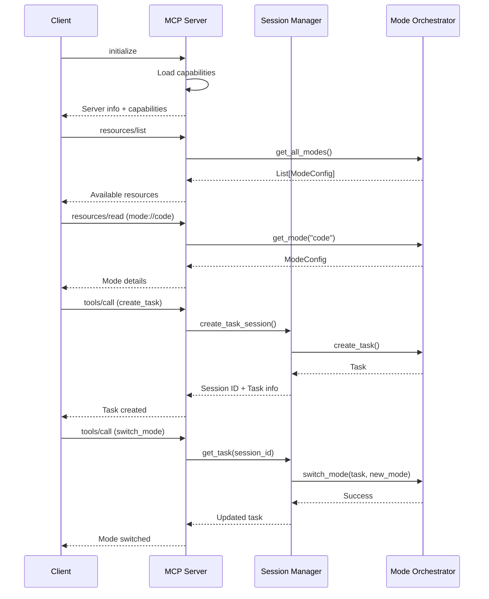

# MCP Modes Server Architecture

## Executive Summary

This document specifies the architecture for exposing the Python SDK's mode system as an MCP (Model Context Protocol) server. The server enables external clients to interact with Roo-Code's powerful mode system through a standardized JSON-RPC 2.0 interface over stdin/stdout.

**Version:** 1.0  
**Date:** 2025-11-13  
**Status:** Implementation Ready

---

## Table of Contents

1. [Overview](#1-overview)
2. [System Architecture](#2-system-architecture)
3. [MCP Server Core](#3-mcp-server-core)
4. [Resources: Modes as MCP Resources](#4-resources-modes-as-mcp-resources)
5. [Tools: Mode Operations as MCP Tools](#5-tools-mode-operations-as-mcp-tools)
6. [State Management](#6-state-management)
7. [Configuration and Deployment](#7-configuration-and-deployment)
8. [Security and Validation](#8-security-and-validation)
9. [File Structure](#9-file-structure)
10. [Implementation Details](#10-implementation-details)
11. [Examples](#11-examples)

---

## 1. Overview

### 1.1 Purpose

The MCP Modes Server bridges the gap between Roo-Code's sophisticated mode system and external tools/applications through the Model Context Protocol. It enables:

- **Mode Discovery**: Query available modes and their configurations
- **Task Management**: Create, switch, and manage mode-aware tasks
- **Tool Restriction**: Enforce mode-specific tool access policies
- **Session Management**: Maintain task context across multiple interactions
- **Real-time Access**: Dynamic mode configuration updates

### 1.2 Key Features

- **Standards-Based**: Full MCP protocol compliance (JSON-RPC 2.0)
- **Zero Dependencies**: Uses Python stdlib only
- **Async Architecture**: Built on asyncio for concurrent operations
- **Type-Safe**: Comprehensive type hints throughout
- **Stateful Sessions**: Maintains task hierarchies and conversation history
- **Security-First**: File access validation and tool restriction enforcement

### 1.3 Architecture Principles

1. **Separation of Concerns**: Clear boundaries between protocol, mode logic, and state
2. **Backwards Compatibility**: No changes to existing mode system
3. **Extensibility**: Easy to add new resources and tools
4. **Robustness**: Comprehensive error handling and validation
5. **Performance**: Minimal overhead, efficient message handling

---

## 2. System Architecture

### 2.1 High-Level Architecture

```
┌─────────────────────────────────────────────────────────────┐
│                        MCP Client                            │
│                   (VSCode, CLI, etc.)                        │
└──────────────────────┬──────────────────────────────────────┘
                       │ JSON-RPC 2.0 (stdin/stdout)
                       │
┌──────────────────────▼──────────────────────────────────────┐
│                  MCP Modes Server                            │
│  ┌────────────────────────────────────────────────────────┐ │
│  │            Protocol Layer (McpModesServer)             │ │
│  │  - Message routing                                      │ │
│  │  - Request/response handling                           │ │
│  │  - JSON-RPC 2.0 compliance                             │ │
│  └────────────┬───────────────────────────┬───────────────┘ │
│               │                           │                  │
│  ┌────────────▼─────────────┐ ┌──────────▼───────────────┐ │
│  │   Resource Handlers       │ │    Tool Handlers         │ │
│  │  - list_resources         │ │  - list_tools            │ │
│  │  - read_resource          │ │  - call_tool             │ │
│  └────────────┬─────────────┘ └──────────┬───────────────┘ │
│               │                           │                  │
│  ┌────────────▼───────────────────────────▼───────────────┐ │
│  │              Session Manager                            │ │
│  │  - Task lifecycle management                            │ │
│  │  - State persistence                                    │ │
│  │  - Task hierarchy tracking                              │ │
│  └────────────┬──────────────────────────────────────────┘ │
│               │                                              │
│  ┌────────────▼──────────────────────────────────────────┐ │
│  │           Mode System Integration                      │ │
│  │  - ModeOrchestrator (existing)                         │ │
│  │  - ModeConfigLoader (existing)                         │ │
│  │  - Task management (existing)                          │ │
│  └───────────────────────────────────────────────────────┘ │
└─────────────────────────────────────────────────────────────┘
```

### 2.2 Component Interactions



### 2.3 Data Flow

1. **Initialization Flow**: Client connects → Server loads modes → Handshake complete
2. **Discovery Flow**: Client requests resources → Server queries orchestrator → Returns mode list
3. **Task Creation Flow**: Client calls create_task tool → Session manager creates task → Returns session ID
4. **Mode Switch Flow**: Client calls switch_mode → Session retrieves task → Orchestrator validates and switches → Updates task state
5. **Validation Flow**: Every operation → Session manager validates → Orchestrator checks restrictions → Execute or reject

---

## 3. MCP Server Core

### 3.1 Server Class Structure

```python
class McpModesServer:
    """
    Main MCP server class handling protocol communication and routing.
    
    Responsibilities:
    - JSON-RPC 2.0 message handling
    - Request routing to appropriate handlers
    - Response formatting and error handling
    - Process lifecycle management
    """
    
    def __init__(
        self,
        project_root: Optional[Path] = None,
        global_config_dir: Optional[Path] = None,
        session_timeout: int = 3600,  # 1 hour default
    ):
        """
        Initialize MCP Modes Server.
        
        Args:
            project_root: Project directory for loading project modes
            global_config_dir: Global config directory (~/.roo-code)
            session_timeout: Session timeout in seconds
        """
        self.project_root = project_root
        self.orchestrator = ModeOrchestrator(project_root, global_config_dir)
        self.session_manager = SessionManager(self.orchestrator, session_timeout)
        
        # Server state
        self.running = False
        self.initialized = False
        self.capabilities = self._build_capabilities()
        
        # I/O streams
        self.stdin = sys.stdin.buffer
        self.stdout = sys.stdout.buffer
        
        # Message handling
        self.request_handlers = self._register_request_handlers()
        self.notification_handlers = self._register_notification_handlers()
```

### 3.2 Message Handling

#### 3.2.1 Request Handler Registration

```python
def _register_request_handlers(self) -> Dict[str, Callable]:
    """Register all JSON-RPC request handlers."""
    return {
        # Protocol methods
        "initialize": self._handle_initialize,
        
        # Resource methods
        "resources/list": self._handle_list_resources,
        "resources/read": self._handle_read_resource,
        
        # Tool methods
        "tools/list": self._handle_list_tools,
        "tools/call": self._handle_call_tool,
        
        # Prompt methods (optional, for future)
        "prompts/list": self._handle_list_prompts,
        "prompts/get": self._handle_get_prompt,
    }
```

#### 3.2.2 Message Processing Loop

```python
async def run(self) -> None:
    """
    Main server loop - reads from stdin, processes messages, writes to stdout.
    
    Message Format (newline-delimited JSON):
    {
        "jsonrpc": "2.0",
        "id": 1,
        "method": "resources/list",
        "params": {}
    }
    """
    self.running = True
    
    try:
        while self.running:
            # Read message (newline-delimited)
            line = await asyncio.get_event_loop().run_in_executor(
                None, self.stdin.readline
            )
            
            if not line:
                break  # EOF
            
            try:
                message = json.loads(line.decode('utf-8'))
                await self._process_message(message)
            except json.JSONDecodeError as e:
                await self._send_error(None, -32700, "Parse error", str(e))
            except Exception as e:
                logger.exception("Error processing message")
                await self._send_error(None, -32603, "Internal error", str(e))
                
    finally:
        await self.shutdown()
```

#### 3.2.3 Response Formatting

```python
async def _send_response(
    self,
    request_id: Any,
    result: Any
) -> None:
    """Send successful JSON-RPC response."""
    response = {
        "jsonrpc": "2.0",
        "id": request_id,
        "result": result
    }
    await self._write_message(response)

async def _send_error(
    self,
    request_id: Any,
    code: int,
    message: str,
    data: Any = None
) -> None:
    """Send JSON-RPC error response."""
    error = {
        "jsonrpc": "2.0",
        "id": request_id,
        "error": {
            "code": code,
            "message": message
        }
    }
    if data is not None:
        error["error"]["data"] = data
    await self._write_message(error)
```

### 3.3 Error Handling Strategy

#### 3.3.1 Error Codes

```python
class McpErrorCode(IntEnum):
    """Standard JSON-RPC and MCP-specific error codes."""
    
    # JSON-RPC standard errors
    PARSE_ERROR = -32700
    INVALID_REQUEST = -32600
    METHOD_NOT_FOUND = -32601
    INVALID_PARAMS = -32602
    INTERNAL_ERROR = -32603
    
    # MCP-specific errors
    MODE_NOT_FOUND = -32001
    TASK_NOT_FOUND = -32002
    SESSION_EXPIRED = -32003
    VALIDATION_ERROR = -32004
    TOOL_RESTRICTION_ERROR = -32005
    FILE_RESTRICTION_ERROR = -32006
```

#### 3.3.2 Error Response Pattern

```python
async def _handle_call_tool(
    self,
    request_id: Any,
    params: Dict[str, Any]
) -> None:
    """Handle tool call with comprehensive error handling."""
    try:
        # Validate parameters
        tool_name = params.get("name")
        if not tool_name:
            await self._send_error(
                request_id,
                McpErrorCode.INVALID_PARAMS,
                "Missing required parameter: name"
            )
            return
        
        # Execute tool
        result = await self._execute_tool(tool_name, params.get("arguments", {}))
        await self._send_response(request_id, result)
        
    except ValueError as e:
        await self._send_error(
            request_id,
            McpErrorCode.VALIDATION_ERROR,
            "Validation error",
            str(e)
        )
    except KeyError as e:
        await self._send_error(
            request_id,
            McpErrorCode.TASK_NOT_FOUND,
            "Task or session not found",
            str(e)
        )
    except Exception as e:
        logger.exception(f"Error executing tool {tool_name}")
        await self._send_error(
            request_id,
            McpErrorCode.INTERNAL_ERROR,
            "Internal server error",
            str(e)
        )
```

### 3.4 Process Lifecycle

```python
async def shutdown(self) -> None:
    """
    Graceful shutdown of the server.
    
    - Closes all active sessions
    - Saves session state if configured
    - Cleans up resources
    """
    logger.info("Shutting down MCP Modes Server")
    self.running = False
    
    # Clean up sessions
    await self.session_manager.cleanup_all()
    
    # Final log
    logger.info("Server shutdown complete")
```

---

## 4. Resources: Modes as MCP Resources

### 4.1 Resource URI Scheme

Resources represent modes and their configurations. URI format:

```
mode://{mode_slug}[/config|/system_prompt]
```

**Examples:**
- `mode://code` - Full code mode configuration
- `mode://architect` - Full architect mode configuration
- `mode://code/config` - Just the ModeConfig object
- `mode://code/system_prompt` - System prompt for code mode

### 4.2 Resource Structure

#### 4.2.1 Mode Resource (Full)

```json
{
  "uri": "mode://code",
  "name": "💻 Code Mode",
  "mimeType": "application/json",
  "description": "Complete configuration for code mode including all metadata"
}
```

**Content returned by `resources/read`:**

```json
{
  "contents": [
    {
      "uri": "mode://code",
      "mimeType": "application/json",
      "text": "{
        \"slug\": \"code\",
        \"name\": \"💻 Code\",
        \"source\": \"builtin\",
        \"description\": \"Write, modify, or refactor code\",
        \"when_to_use\": \"Use this mode when you need to...\",
        \"role_definition\": \"You are an expert programmer...\",
        \"tool_groups\": {
          \"read\": {\"enabled\": true},
          \"edit\": {\"enabled\": true},
          \"browser\": {\"enabled\": true},
          \"command\": {\"enabled\": true},
          \"mcp\": {\"enabled\": true},
          \"modes\": {\"enabled\": true}
        },
        \"file_restrictions\": null,
        \"custom_instructions\": \"...\"
      }"
    }
  ]
}
```

#### 4.2.2 Config Resource (Structured)

```json
{
  "uri": "mode://architect/config",
  "name": "🏗️ Architect Mode - Configuration",
  "mimeType": "application/json",
  "description": "Structured configuration data for architect mode"
}
```

**Content:**

```json
{
  "contents": [
    {
      "uri": "mode://architect/config",
      "mimeType": "application/json", 
      "text": "{
        \"slug\": \"architect\",
        \"name\": \"🏗️ Architect\",
        \"source\": \"builtin\",
        \"groups\": [
          \"read\",
          [\"edit\", {\"fileRegex\": \"\\\\.md$\"}]
        ]
      }"
    }
  ]
}
```

#### 4.2.3 System Prompt Resource

```json
{
  "uri": "mode://debug/system_prompt",
  "name": "🪲 Debug Mode - System Prompt",
  "mimeType": "text/plain",
  "description": "System prompt used for debug mode"
}
```

### 4.3 Resource Handler Implementation

```python
class ResourceHandler:
    """Handles MCP resource operations for modes."""
    
    def __init__(self, orchestrator: ModeOrchestrator):
        self.orchestrator = orchestrator
    
    async def list_resources(self) -> List[Dict[str, Any]]:
        """
        List all available mode resources.
        
        Returns:
            List of resource descriptors
        """
        resources = []
        
        for mode in self.orchestrator.get_all_modes():
            # Full mode resource
            resources.append({
                "uri": f"mode://{mode.slug}",
                "name": mode.name,
                "mimeType": "application/json",
                "description": mode.description or f"Full configuration for {mode.name}"
            })
            
            # Config resource
            resources.append({
                "uri": f"mode://{mode.slug}/config",
                "name": f"{mode.name} - Configuration",
                "mimeType": "application/json",
                "description": f"Structured configuration for {mode.name}"
            })
            
            # System prompt resource
            resources.append({
                "uri": f"mode://{mode.slug}/system_prompt",
                "name": f"{mode.name} - System Prompt",
                "mimeType": "text/plain",
                "description": f"System prompt for {mode.name}"
            })
        
        return resources
    
    async def read_resource(self, uri: str) -> Dict[str, Any]:
        """
        Read a specific mode resource.
        
        Args:
            uri: Resource URI (e.g., "mode://code" or "mode://code/config")
            
        Returns:
            Resource contents
            
        Raises:
            ValueError: If URI is invalid or mode not found
        """
        # Parse URI
        if not uri.startswith("mode://"):
            raise ValueError(f"Invalid mode URI: {uri}")
        
        parts = uri[7:].split("/")  # Remove "mode://"
        mode_slug = parts[0]
        subresource = parts[1] if len(parts) > 1 else None
        
        # Get mode
        mode = self.orchestrator.get_mode(mode_slug)
        if not mode:
            raise ValueError(f"Mode not found: {mode_slug}")
        
        # Generate content based on subresource
        if subresource == "config":
            content = self._serialize_mode_config(mode)
            mime_type = "application/json"
        elif subresource == "system_prompt":
            # Generate system prompt using orchestrator
            temp_task = Task(mode_slug=mode_slug)
            content = self.orchestrator.get_system_prompt(temp_task)
            mime_type = "text/plain"
        else:
            # Full mode resource
            content = self._serialize_mode_full(mode)
            mime_type = "application/json"
        
        return {
            "contents": [
                {
                    "uri": uri,
                    "mimeType": mime_type,
                    "text": content
                }
            ]
        }
    
    def _serialize_mode_config(self, mode: ModeConfig) -> str:
        """Serialize mode to config JSON."""
        config = {
            "slug": mode.slug,
            "name": mode.name,
            "source": mode.source.value,
            "groups": []
        }
        
        # Serialize groups
        for entry in mode.groups:
            if isinstance(entry, tuple):
                group_name, options = entry
                group_data = [group_name, {}]
                if options.file_regex:
                    group_data[1]["fileRegex"] = options.file_regex
                if options.description:
                    group_data[1]["description"] = options.description
                config["groups"].append(group_data)
            else:
                config["groups"].append(entry)
        
        return json.dumps(config, indent=2)
    
    def _serialize_mode_full(self, mode: ModeConfig) -> str:
        """Serialize full mode information."""
        data = {
            "slug": mode.slug,
            "name": mode.name,
            "source": mode.source.value,
            "description": mode.description,
            "when_to_use": mode.when_to_use,
            "role_definition": mode.role_definition,
            "custom_instructions": mode.custom_instructions,
            "tool_groups": {}
        }
        
        # Add tool group info
        for group in ["read", "edit", "browser", "command", "mcp", "modes"]:
            enabled = mode.is_tool_group_enabled(group)
            options = mode.get_group_options(group) if enabled else None
            
            data["tool_groups"][group] = {
                "enabled": enabled
            }
            
            if options and options.file_regex:
                data["tool_groups"][group]["file_regex"] = options.file_regex
        
        return json.dumps(data, indent=2)
```

---

## 5. Tools: Mode Operations as MCP Tools

### 5.1 Tool Definitions

#### 5.1.1 List Modes Tool

**Tool Definition:**
```json
{
  "name": "list_modes",
  "description": "List all available modes with their metadata",
  "inputSchema": {
    "type": "object",
    "properties": {
      "source": {
        "type": "string",
        "enum": ["builtin", "global", "project", "all"],
        "description": "Filter modes by source (default: all)"
      }
    }
  }
}
```

**Response Format:**
```json
{
  "content": [
    {
      "type": "text",
      "text": "Available modes:\n\n1. code (💻 Code) - builtin\n   Description: Write, modify, or refactor code\n   Tool groups: read, edit, browser, command, mcp, modes\n\n2. architect (🏗️ Architect) - builtin\n   Description: Plan and design solutions\n   Tool groups: read, edit (*.md only)\n   ..."
    }
  ]
}
```

#### 5.1.2 Get Mode Info Tool

**Tool Definition:**
```json
{
  "name": "get_mode_info",
  "description": "Get detailed information about a specific mode",
  "inputSchema": {
    "type": "object",
    "properties": {
      "mode_slug": {
        "type": "string",
        "description": "Slug of the mode to get info for"
      },
      "include_system_prompt": {
        "type": "boolean",
        "description": "Include the full system prompt (default: false)"
      }
    },
    "required": ["mode_slug"]
  }
}
```

**Response Format:**
```json
{
  "content": [
    {
      "type": "text",
      "text": "Mode: 💻 Code (code)\nSource: builtin\nDescription: Write, modify, or refactor code\n\nWhen to use:\n- Implementing features\n- Fixing bugs\n- Refactoring code\n\nTool Groups:\n✓ read\n✓ edit\n✓ browser\n✓ command\n✓ mcp\n✓ modes"
    }
  ]
}
```

#### 5.1.3 Create Task Tool

**Tool Definition:**
```json
{
  "name": "create_task",
  "description": "Create a new task in a specific mode",
  "inputSchema": {
    "type": "object",
    "properties": {
      "mode_slug": {
        "type": "string",
        "description": "Mode to use for this task"
      },
      "initial_message": {
        "type": "string",
        "description": "Initial user message for the task"
      },
      "parent_session_id": {
        "type": "string",
        "description": "Parent session ID if this is a subtask"
      }
    },
    "required": ["mode_slug"]
  }
}
```

**Response Format:**
```json
{
  "content": [
    {
      "type": "text",
      "text": "Task created successfully\n\nSession ID: ses_a1b2c3d4e5f6\nTask ID: task_x7y8z9\nMode: code (💻 Code)\nState: pending\n\nUse this session_id for subsequent operations."
    }
  ],
  "metadata": {
    "session_id": "ses_a1b2c3d4e5f6",
    "task_id": "task_x7y8z9",
    "mode_slug": "code"
  }
}
```

#### 5.1.4 Switch Mode Tool

**Tool Definition:**
```json
{
  "name": "switch_mode",
  "description": "Switch a task to a different mode",
  "inputSchema": {
    "type": "object",
    "properties": {
      "session_id": {
        "type": "string",
        "description": "Session ID of the task"
      },
      "new_mode_slug": {
        "type": "string",
        "description": "Slug of the mode to switch to"
      },
      "reason": {
        "type": "string",
        "description": "Reason for switching modes (optional)"
      }
    },
    "required": ["session_id", "new_mode_slug"]
  }
}
```

**Response Format:**
```json
{
  "content": [
    {
      "type": "text",
      "text": "Mode switched successfully\n\nSession: ses_a1b2c3d4e5f6\nOld mode: code\nNew mode: debug\nReason: Need to troubleshoot error\n\nNew tool groups:\n✓ read\n✓ edit\n✓ command\n✗ browser (not available in debug mode)"
    }
  ]
}
```

#### 5.1.5 Get Task Info Tool

**Tool Definition:**
```json
{
  "name": "get_task_info",
  "description": "Get information about a task/session",
  "inputSchema": {
    "type": "object",
    "properties": {
      "session_id": {
        "type": "string",
        "description": "Session ID"
      },
      "include_messages": {
        "type": "boolean",
        "description": "Include conversation history (default: false)"
      },
      "include_hierarchy": {
        "type": "boolean",
        "description": "Include parent/child task info (default: false)"
      }
    },
    "required": ["session_id"]
  }
}
```

#### 5.1.6 Validate Tool Use

**Tool Definition:**
```json
{
  "name": "validate_tool_use",
  "description": "Check if a tool can be used in the current mode",
  "inputSchema": {
    "type": "object",
    "properties": {
      "session_id": {
        "type": "string",
        "description": "Session ID"
      },
      "tool_name": {
        "type": "string",
        "description": "Name of the tool to validate"
      },
      "file_path": {
        "type": "string",
        "description": "File path (for edit operations)"
      }
    },
    "required": ["session_id", "tool_name"]
  }
}
```

**Response Format:**
```json
{
  "content": [
    {
      "type": "text",
      "text": "✓ Tool 'read_file' is allowed in mode 'code'\n\nNote: All read operations are permitted in code mode."
    }
  ],
  "metadata": {
    "allowed": true,
    "tool_name": "read_file",
    "mode": "code"
  }
}
```

or for restricted:

```json
{
  "content": [
    {
      "type": "text",
      "text": "✗ Tool 'write_to_file' is restricted in mode 'architect'\n\nFile 'src/app.py' does not match allowed pattern: \\.md$\n\nArchitect mode can only edit markdown files."
    }
  ],
  "metadata": {
    "allowed": false,
    "tool_name": "write_to_file",
    "mode": "architect",
    "restriction": "\\.md$"
  }
}
```

#### 5.1.7 Complete Task Tool

**Tool Definition:**
```json
{
  "name": "complete_task",
  "description": "Mark a task as completed or failed",
  "inputSchema": {
    "type": "object",
    "properties": {
      "session_id": {
        "type": "string",
        "description": "Session ID"
      },
      "status": {
        "type": "string",
        "enum": ["completed", "failed", "cancelled"],
        "description": "Final status of the task"
      },
      "result": {
        "type": "string",
        "description": "Completion result or error message"
      }
    },
    "required": ["session_id", "status"]
  }
}
```

### 5.2 Tool Handler Implementation

```python
class ToolHandler:
    """Handles MCP tool operations for modes."""
    
    def __init__(
        self,
        session_manager: SessionManager,
        orchestrator: ModeOrchestrator
    ):
        self.session_manager = session_manager
        self.orchestrator = orchestrator
        
        # Register tool implementations
        self.tools = {
            "list_modes": self._list_modes,
            "get_mode_info": self._get_mode_info,
            "create_task": self._create_task,
            "switch_mode": self._switch_mode,
            "get_task_info": self._get_task_info,
            "validate_tool_use": self._validate_tool_use,
            "complete_task": self._complete_task,
        }
    
    async def list_tools(self) -> List[Dict[str, Any]]:
        """Return list of available tools."""
        return [
            {
                "name": "list_modes",
                "description": "List all available modes with their metadata",
                "inputSchema": {
                    "type": "object",
                    "properties": {
                        "source": {
                            "type": "string",
                            "enum": ["builtin", "global", "project", "all"],
                            "description": "Filter modes by source (default: all)"
                        }
                    }
                }
            },
            # ... other tool definitions
        ]
    
    async def call_tool(
        self,
        tool_name: str,
        arguments: Dict[str, Any]
    ) -> Dict[str, Any]:
        """
        Execute a tool.
        
        Args:
            tool_name: Name of tool to execute
            arguments: Tool arguments
            
        Returns:
            Tool result in MCP format
            
        Raises:
            ValueError: If tool not found or validation fails
        """
        if tool_name not in self.tools:
            raise ValueError(f"Unknown tool: {tool_name}")
        
        tool_func = self.tools[tool_name]
        return await tool_func(arguments)
    
    async def _list_modes(self, args: Dict[str, Any]) -> Dict[str, Any]:
        """Implementation of list_modes tool."""
        source_filter = args.get("source", "all")
        modes = self.orchestrator.get_all_modes()
        
        # Filter by source if requested
        if source_filter != "all":
            modes = [m for m in modes if m.source.value == source_filter]
        
        # Format output
        lines = ["Available modes:\n"]
        for i, mode in enumerate(modes, 1):
            lines.append(f"{i}. {mode.slug} ({mode.name}) - {mode.source.value}")
            if mode.description:
                lines.append(f"   Description: {mode.description}")
            
            # Tool groups summary
            groups = [entry[0] if isinstance(entry, tuple) else entry 
                     for entry in mode.groups]
            lines.append(f"   Tool groups: {', '.join(groups)}")
            lines.append("")
        
        return {
            "content": [
                {
                    "type": "text",
                    "text": "\n".join(lines)
                }
            ]
        }
    
    async def _create_task(self, args: Dict[str, Any]) -> Dict[str, Any]:
        """Implementation of create_task tool."""
        mode_slug = args["mode_slug"]
        initial_message = args.get("initial_message")
        parent_session_id = args.get("parent_session_id")
        
        # Validate mode exists
        if not self.orchestrator.validate_mode_exists(mode_slug):
            raise ValueError(
                f"Invalid mode '{mode_slug}'. "
                f"Available: {', '.join(self.orchestrator.get_mode_names())}"
            )
        
        # Get parent task if specified
        parent_task = None
        if parent_session_id:
            parent_session = self.session_manager.get_session(parent_session_id)
            if not parent_session:
                raise ValueError(f"Parent session not found: {parent_session_id}")
            parent_task = parent_session.task
        
        # Create task
        task = self.orchestrator.create_task(
            mode_slug=mode_slug,
            initial_message=initial_message,
            parent_task=parent_task
        )
        
        # Create session
        session = self.session_manager.create_session(task)
        
        # Format response
        mode = self.orchestrator.get_mode(mode_slug)
        text = (
            f"Task created successfully\n\n"
            f"Session ID: {session.session_id}\n"
            f"Task ID: {task.task_id}\n"
            f"Mode: {mode_slug} ({mode.name if mode else 'Unknown'})\n"
            f"State: {task.state.value}\n\n"
            f"Use this session_id for subsequent operations."
        )
        
        return {
            "content": [{"type": "text", "text": text}],
            "metadata": {
                "session_id": session.session_id,
                "task_id": task.task_id,
                "mode_slug": mode_slug
            }
        }
    
    async def _switch_mode(self, args: Dict[str, Any]) -> Dict[str, Any]:
        """Implementation of switch_mode tool."""
        session_id = args["session_id"]
        new_mode_slug = args["new_mode_slug"]
        reason = args.get("reason")
        
        # Get session
        session = self.session_manager.get_session(session_id)
        if not session:
            raise ValueError(f"Session not found: {session_id}")
        
        task = session.task
        old_mode_slug = task.mode_slug
        
        # Validate new mode
        if not self.orchestrator.validate_mode_exists(new_mode_slug):
            raise ValueError(f"Invalid mode: {new_mode_slug}")
        
        # Switch mode
        success = self.orchestrator.switch_mode(task, new_mode_slug)
        if not success:
            raise ValueError(f"Failed to switch to mode: {new_mode_slug}")
        
        # Add reason to task metadata if provided
        if reason:
            task.metadata["mode_switch_reason"] = reason
        
        # Format response
        new_mode = self.orchestrator.get_mode(new_mode_slug)
        text = (
            f"Mode switched successfully\n\n"
            f"Session: {session_id}\n"
            f"Old mode: {old_mode_slug}\n"
            f"New mode: {new_mode_slug}\n"
        )
        
        if reason:
            text += f"Reason: {reason}\n"
        
        if new_mode:
            text += f"\nNew tool groups:\n"
            for group in ["read", "edit", "browser", "command", "mcp", "modes"]:
                enabled = new_mode.is_tool_group_enabled(group)
                status = "✓" if enabled else "✗"
                text += f"{status} {group}"
                
                if not enabled:
                    text += " (not available)"
                else:
                    options = new_mode.get_group_options(group)
                    if options and options.file_regex:
                        text += f" (restricted to: {options.file_regex})"
                
                text += "\n"
        
        return {
            "content": [{"type": "text", "text": text}],
            "metadata": {
                "old_mode": old_mode_slug,
                "new_mode": new_mode_slug
            }
        }
    
    async def _validate_tool_use(
        self,
        args: Dict[str, Any]
    ) -> Dict[str, Any]:
        """Implementation of validate_tool_use tool."""
        session_id = args["session_id"]
        tool_name = args["tool_name"]
        file_path = args.get("file_path")
        
        # Get session
        session = self.session_manager.get_session(session_id)
        if not session:
            raise ValueError(f"Session not found: {session_id}")
        
        task = session.task
        
        # Build tool args for validation
        tool_args = {}
        if file_path:
            tool_args["path"] = file_path
        
        # Validate
        is_valid, error_message = self.orchestrator.validate_tool_use(
            task,
            tool_name,
            tool_args
        )
        
        # Format response
        mode = self.orchestrator.get_mode(task.mode_slug)
        mode_name = mode.name if mode else task.mode_slug
        
        if is_valid:
            text = f"✓ Tool '{tool_name}' is allowed in mode '{mode_name}'"
            if file_path:
                text += f" for file '{file_path}'"
        else:
            text = f"✗ {error_message}"
        
        return {
            "content": [{"type": "text", "text": text}],
            "metadata": {
                "allowed": is_valid,
                "tool_name": tool_name,
                "mode": task.mode_slug,
                "error": error_message if not is_valid else None
            }
        }
```

---

## 6. State Management

### 6.1 Session Management

#### 6.1.1 Session Class

```python
@dataclass
class Session:
    """
    Represents an active session with a task.
    
    A session wraps a task and adds session-specific metadata
    like creation time, last access, and session ID for client reference.
    """
    
    session_id: str = field(default_factory=lambda: f"ses_{uuid4().hex[:12]}")
    task: Task
    created_at: datetime = field(default_factory=datetime.now)
    last_accessed: datetime = field(default_factory=datetime.now)
    metadata: Dict[str, Any] = field(default_factory=dict)
    
    def touch(self) -> None:
        """Update last accessed timestamp."""
        self.last_accessed = datetime.now()
    
    def is_expired(self, timeout_seconds: int) -> bool:
        """Check if session has expired."""
        elapsed = (datetime.now() - self.last_accessed).total_seconds()
        return elapsed > timeout_seconds
```

#### 6.1.2 SessionManager Class

```python
class SessionManager:
    """
    Manages sessions and their lifecycle.
    
    Responsibilities:
    - Create and destroy sessions
    - Track task-session mappings
    - Handle session expiration
    - Maintain task hierarchies
    """
    
    def __init__(
        self,
        orchestrator: ModeOrchestrator,
        timeout: int = 3600,  # 1 hour
        cleanup_interval: int = 300  # 5 minutes
    ):
        """
        Initialize session manager.
        
        Args:
            orchestrator: Mode orchestrator for task management
            timeout: Session timeout in seconds
            cleanup_interval: How often to run cleanup (seconds)
        """
        self.orchestrator = orchestrator
        self.timeout = timeout
        self.cleanup_interval = cleanup_interval
        
        # Session storage
        self.sessions: Dict[str, Session] = {}
        self.task_to_session: Dict[str, str] = {}  # task_id -> session_id
        
        # Cleanup task
        self.cleanup_task: Optional[asyncio.Task] = None
        self.running = False
    
    async def start(self) -> None:
        """Start the session manager and cleanup task."""
        self.running = True
        self.cleanup_task = asyncio.create_task(self._cleanup_loop())
    
    async def stop(self) -> None:
        """Stop the session manager."""
        self.running = False
        if self.cleanup_task:
            self.cleanup_task.cancel()
            try:
                await self.cleanup_task
            except asyncio.CancelledError:
                pass
    
    def create_session(self, task: Task) -> Session:
        """
        Create a new session for a task.
        
        Args:
            task: Task to create session for
            
        Returns:
            Created session
        """
        session = Session(task=task)
        self.sessions[session.session_id] = session
        self.task_to_session[task.task_id] = session.session_id
        
        logger.info(f"Created session {session.session_id} for task {task.task_id}")
        return session
    
    def get_session(self, session_id: str) -> Optional[Session]:
        """
        Get a session by ID.
        
        Args:
            session_id: Session ID to retrieve
            
        Returns:
            Session if found and not expired, None otherwise
        """
        session = self.sessions.get(session_id)
        if not session:
            return None
        
        # Check expiration
        if session.is_expired(self.timeout):
            logger.info(f"Session {session_id} has expired")
            self._cleanup_session(session_id)
            return None
        
        # Update access time
        session.touch()
        return session
    
    def get_session_by_task(self, task_id: str) -> Optional[Session]:
        """Get session by task ID."""
        session_id = self.task_to_session.get(task_id)
        if session_id:
            return self.get_session(session_id)
        return None
    
    def destroy_session(self, session_id: str) -> bool:
        """
        Explicitly destroy a session.
        
        Args:
            session_id: Session to destroy
            
        Returns:
            True if session was found and destroyed
        """
        return self._cleanup_session(session_id)
    
    def _cleanup_session(self, session_id: str) -> bool:
        """Internal cleanup of a session."""
        session = self.sessions.pop(session_id, None)
        if session:
            self.task_to_session.pop(session.task.task_id, None)
            logger.info(f"Cleaned up session {session_id}")
            return True
        return False
    
    async def _cleanup_loop(self) -> None:
        """Background task to clean up expired sessions."""
        while self.running:
            try:
                await asyncio.sleep(self.cleanup_interval)
                await self._cleanup_expired()
            except asyncio.CancelledError:
                break
            except Exception as e:
                logger.exception("Error in cleanup loop")
    
    async def _cleanup_expired(self) -> None:
        """Clean up all expired sessions."""
        expired = [
            sid for sid, session in self.sessions.items()
            if session.is_expired(self.timeout)
        ]
        
        for session_id in expired:
            self._cleanup_session(session_id)
        
        if expired:
            logger.info(f"Cleaned up {len(expired)} expired sessions")
    
    async def cleanup_all(self) -> None:
        """Clean up all sessions (for shutdown)."""
        session_ids = list(self.sessions.keys())
        for session_id in session_ids:
            self._cleanup_session(session_id)
        logger.info(f"Cleaned up all {len(session_ids)} sessions")
```

### 6.2 Task Context Tracking

The session manager maintains:

1. **Active Sessions**: Current working sessions
2. **Task Hierarchy**: Parent-child relationships via Task objects
3. **Message History**: Maintained in Task.messages
4. **Mode State**: Current mode via Task.mode_slug

### 6.3 Session Persistence (Optional)

For persistence across server restarts:

```python
class PersistentSessionManager(SessionManager):
    """Session manager with persistence support."""
    
    def __init__(
        self,
        orchestrator: ModeOrchestrator,
        storage_path: Path,
        **kwargs
    ):
        super().__init__(orchestrator, **kwargs)
        self.storage_path = storage_path
        self.storage_path.mkdir(parents=True, exist_ok=True)
    
    async def save_session(self, session: Session) -> None:
        """Save session to disk."""
        file_path = self.storage_path / f"{session.session_id}.json"
        data = {
            "session_id": session.session_id,
            "task": session.task.to_dict(),
            "created_at": session.created_at.isoformat(),
            "last_accessed": session.last_accessed.isoformat(),
            "metadata": session.metadata
        }
        
        async with aiofiles.open(file_path, "w") as f:
            await f.write(json.dumps(data, indent=2))
    
    async def load_session(self, session_id: str) -> Optional[Session]:
        """Load session from disk."""
        file_path = self.storage_path / f"{session_id}.json"
        if not file_path.exists():
            return None
        
        async with aiofiles.open(file_path, "r") as f:
            data = json.loads(await f.read())
        
        task = Task.from_dict(data["task"])
        session = Session(
            session_id=data["session_id"],
            task=task,
            created_at=datetime.fromisoformat(data["created_at"]),
            last_accessed=datetime.fromisoformat(data["last_accessed"]),
            metadata=data["metadata"]
        )
        
        return session
```

---

## 7. Configuration and Deployment

### 7.1 Server Configuration

#### 7.1.1 Configuration File Format

`mcp_modes_server_config.json`:

```json
{
  "server": {
    "name": "roo-modes-server",
    "version": "1.0.0",
    "description": "MCP server exposing Roo-Code mode system"
  },
  "paths": {
    "project_root": null,
    "global_config_dir": "~/.roo-code"
  },
  "sessions": {
    "timeout": 3600,
    "cleanup_interval": 300,
    "persistence": {
      "enabled": false,
      "storage_path": "~/.roo-code/mcp_sessions"
    }
  },
  "logging": {
    "level": "INFO",
    "file": "~/.roo-code/mcp_modes_server.log",
    "format": "%(asctime)s - %(name)s - %(levelname)s - %(message)s"
  }
}
```

#### 7.1.2 Configuration Loader

```python
class ServerConfig:
    """Configuration for MCP Modes Server."""
    
    @classmethod
    def from_file(cls, path: Path) -> "ServerConfig":
        """Load configuration from JSON file."""
        with open(path) as f:
            data = json.load(f)
        
        config = cls()
        config.server_name = data["server"]["name"]
        config.project_root = (
            Path(data["paths"]["project_root"]).expanduser()
            if data["paths"]["project_root"]
            else None
        )
        config.global_config_dir = (
            Path(data["paths"]["global_config_dir"]).expanduser()
        )
        config.session_timeout = data["sessions"]["timeout"]
        config.cleanup_interval = data["sessions"]["cleanup_interval"]
        
        # ... load other settings
        
        return config
    
    @classmethod
    def from_env(cls) -> "ServerConfig":
        """Load configuration from environment variables."""
        config = cls()
        config.project_root = (
            Path(os.getenv("ROO_PROJECT_ROOT")).expanduser()
            if os.getenv("ROO_PROJECT_ROOT")
            else None
        )
        config.global_config_dir = Path(
            os.getenv("ROO_CONFIG_DIR", "~/.roo-code")
        ).expanduser()
        
        # ... load other settings
        
        return config
```

### 7.2 Integration with MCP Config

For VSCode or other MCP clients, add to `mcp_config.json`:

```json
{
  "mcpServers": {
    "roo-modes": {
      "command": "python",
      "args": [
        "-m",
        "roo_code.mcp.modes_server",
        "--config",
        "/path/to/config.json"
      ],
      "env": {
        "ROO_PROJECT_ROOT": "${workspaceFolder}",
        "ROO_CONFIG_DIR": "~/.roo-code"
      }
    }
  }
}
```

### 7.3 Startup and Initialization

#### 7.3.1 Main Entry Point

```python
# roo_code/mcp/modes_server.py

async def main():
    """Main entry point for MCP Modes Server."""
    # Parse arguments
    parser = argparse.ArgumentParser(
        description="MCP server for Roo-Code modes"
    )
    parser.add_argument(
        "--config",
        type=Path,
        help="Path to configuration file"
    )
    parser.add_argument(
        "--project-root",
        type=Path,
        help="Project root directory"
    )
    parser.add_argument(
        "--log-level",
        choices=["DEBUG", "INFO", "WARNING", "ERROR"],
        default="INFO",
        help="Logging level"
    )
    
    args = parser.parse_args()
    
    # Load configuration
    if args.config and args.config.exists():
        config = ServerConfig.from_file(args.config)
    else:
        config = ServerConfig.from_env()
    
    # Override with command line args
    if args.project_root:
        config.project_root = args.project_root
    if args.log_level:
        config.log_level = args.log_level
    
    # Setup logging
    logging.basicConfig(
        level=getattr(logging, config.log_level),
        format=config.log_format,
        handlers=[
            logging.FileHandler(config.log_file.expanduser()),
            logging.StreamHandler()
        ]
    )
    
    # Create and run server
    server = McpModesServer(
        project_root=config.project_root,
        global_config_dir=config.global_config_dir,
        session_timeout=config.session_timeout
    )
    
    try:
        await server.run()
    except KeyboardInterrupt:
        logger.info("Received interrupt signal")
    except Exception as e:
        logger.exception("Server error")
        sys.exit(1)
    finally:
        await server.shutdown()


if __name__ == "__main__":
    asyncio.run(main())
```

#### 7.3.2 Setup Script

```bash
#!/bin/bash
# setup_mcp_modes.sh

# Install package
pip install -e roo-code-python

# Create config directory
mkdir -p ~/.roo-code

# Generate default config
python -m roo_code.mcp.generate_config > ~/.roo-code/mcp_modes_server_config.json

# Add to MCP config
python -m roo_code.mcp.add_to_mcp_config

echo "MCP Modes Server setup complete!"
echo "Restart your MCP client to use the server."
```

---

## 8. Security and Validation

### 8.1 Input Validation

#### 8.1.1 Schema Validation

```python
from typing import Any, Dict, Type
from dataclasses import dataclass

class ValidationError(Exception):
    """Raised when validation fails."""
    pass


class SchemaValidator:
    """Validates inputs against JSON schemas."""
    
    @staticmethod
    def validate_tool_args(
        tool_name: str,
        args: Dict[str, Any],
        schema: Dict[str, Any]
    ) -> None:
        """
        Validate tool arguments against schema.
        
        Args:
            tool_name: Name of the tool
            args: Arguments to validate
            schema: JSON schema to validate against
            
        Raises:
            ValidationError: If validation fails
        """
        # Check required parameters
        required = schema.get("required", [])
        for param in required:
            if param not in args:
                raise ValidationError(
                    f"Missing required parameter for {tool_name}: {param}"
                )
        
        # Validate types
        properties = schema.get("properties", {})
        for param, value in args.items():
            if param not in properties:
                # Extra parameters allowed
                continue
            
            param_schema = properties[param]
            expected_type = param_schema.get("type")
            
            if expected_type == "string" and not isinstance(value, str):
                raise ValidationError(
                    f"Parameter {param} must be a string"
                )
            elif expected_type == "number" and not isinstance(value, (int, float)):
                raise ValidationError(
                    f"Parameter {param} must be a number"
                )
            elif expected_type == "boolean" and not isinstance(value, bool):
                raise ValidationError(
                    f"Parameter {param} must be a boolean"
                )
            elif expected_type == "object" and not isinstance(value, dict):
                raise ValidationError(
                    f"Parameter {param} must be an object"
                )
            elif expected_type == "array" and not isinstance(value, list):
                raise ValidationError(
                    f"Parameter {param} must be an array"
                )
            
            # Validate enums
            if "enum" in param_schema:
                if value not in param_schema["enum"]:
                    raise ValidationError(
                        f"Parameter {param} must be one of: "
                        f"{', '.join(param_schema['enum'])}"
                    )
```

### 8.2 Tool Restriction Enforcement

Tool restrictions are enforced through the [`ModeOrchestrator`](roo-code-python/roo_code/modes/orchestrator.py:16) class:

1. **Group-Level Restrictions**: Tools are mapped to groups (read, edit, etc.)
2. **File-Level Restrictions**: Edit operations check file patterns
3. **Validation Before Execution**: All tool calls validated before execution

```python
async def _execute_tool(
    self,
    tool_name: str,
    arguments: Dict[str, Any]
) -> Dict[str, Any]:
    """Execute a tool with validation."""
    # Get session
    session_id = arguments.get("session_id")
    if session_id:
        session = self.session_manager.get_session(session_id)
        if not session:
            raise ValueError(f"Session not found: {session_id}")
        
        task = session.task
        
        # Validate tool use
        is_valid, error = self.orchestrator.validate_tool_use(
            task,
            tool_name,
            arguments
        )
        
        if not is_valid:
            raise ToolRestrictionError(error)
    
    # Execute tool
    handler = self.tool_handler
    return await handler.call_tool(tool_name, arguments)
```

### 8.3 File Access Control

File access validation happens at multiple levels:

1. **Mode Configuration**: File regex patterns in [`ModeConfig`](roo-code-python/roo_code/modes/config.py:61)
2. **Orchestrator Validation**: [`can_edit_file()`](roo-code-python/roo_code/modes/orchestrator.py:209) method
3. **Tool Handler**: Pre-execution validation

```python
def _validate_file_access(
    self,
    task: Task,
    file_path: str,
    operation: str
) -> Tuple[bool, Optional[str]]:
    """
    Validate file access for a task.
    
    Args:
        task: Current task
        file_path: File to access
        operation: Operation type (read, write, etc.)
        
    Returns:
        (is_allowed, error_message)
    """
    # Read operations generally allowed if read group enabled
    if operation == "read":
        if not self.orchestrator.can_use_tool(task, "read_file"):
            return False, "Read operations not allowed in current mode"
        return True, None
    
    # Write operations require edit group and file pattern match
    if operation in ["write", "edit", "insert"]:
        if not self.orchestrator.can_edit_file(task, file_path):
            mode = self.orchestrator.get_mode(task.mode_slug)
            options = mode.get_group_options("edit") if mode else None
            pattern = options.file_regex if options else None
            
            return False, (
                f"File '{file_path}' cannot be edited in mode "
                f"'{mode.name if mode else task.mode_slug}'. "
                f"Must match pattern: {pattern}"
            )
        return True, None
    
    return True, None
```

### 8.4 Error Boundaries

Each layer has error handling:

1. **Protocol Layer**: JSON-RPC errors
2. **Handler Layer**: Tool-specific errors
3. **Business Logic Layer**: Validation and permission errors
4. **System Layer**: Internal errors

```python
class ErrorBoundary:
    """Wraps handlers with error boundaries."""
    
    @staticmethod
    async def wrap_handler(
        handler_func: Callable,
        *args,
        **kwargs
    ) -> Any:
        """
        Execute handler with error boundary.
        
        Returns result or raises appropriate error.
        """
        try:
            return await handler_func(*args, **kwargs)
        except ValidationError as e:
            raise McpProtocolError(
                code=McpErrorCode.VALIDATION_ERROR,
                message="Validation failed",
                data=str(e)
            )
        except ToolRestrictionError as e:
            raise McpProtocolError(
                code=McpErrorCode.TOOL_RESTRICTION_ERROR,
                message="Tool restricted",
                data=str(e)
            )
        except FileRestrictionError as e:
            raise McpProtocolError(
                code=McpErrorCode.FILE_RESTRICTION_ERROR,
                message="File access restricted",
                data=str(e)
            )
        except Exception as e:
            logger.exception("Unexpected error in handler")
            raise McpProtocolError(
                code=McpErrorCode.INTERNAL_ERROR,
                message="Internal server error",
                data=str(e)
            )
```

---

## 9. File Structure

### 9.1 Proposed Directory Layout

```
roo-code-python/
├── roo_code/
│   ├── mcp/                          # New MCP server package
│   │   ├── __init__.py
│   │   ├── server.py                 # McpModesServer main class
│   │   ├── protocol.py               # JSON-RPC protocol handling
│   │   ├── resources.py              # ResourceHandler implementation
│   │   ├── tools.py                  # ToolHandler implementation
│   │   ├── session.py                # Session and SessionManager
│   │   ├── config.py                 # ServerConfig
│   │   ├── validation.py             # Input validation
│   │   ├── errors.py                 # Custom exceptions
│   │   ├── __main__.py               # Entry point (python -m roo_code.mcp)
│   │   └── utils/
│   │       ├── __init__.py
│   │       ├── generate_config.py    # Config generation utility
│   │       └── add_to_mcp_config.py  # MCP config integration
│   │
│   ├── modes/                        # Existing mode system (unchanged)
│   │   ├── __init__.py
│   │   ├── config.py
│   │   ├── orchestrator.py
│   │   ├── task.py
│   │   └── ...
│   │
│   └── ...                           # Other existing modules
│
├── tests/
│   ├── mcp/                          # MCP server tests
│   │   ├── __init__.py
│   │   ├── test_server.py
│   │   ├── test_resources.py
│   │   ├── test_tools.py
│   │   ├── test_session.py
│   │   ├── test_validation.py
│   │   └── fixtures/
│   │       ├── test_config.json
│   │       └── test_mcp_messages.json
│   │
│   └── ...                           # Other existing tests
│
├── examples/
│   ├── mcp_client_example.py         # Example MCP client usage
│   └── mcp_modes_demo.py             # Demo of mode operations
│
├── docs/
│   ├── mcp_modes_server.md           # User documentation
│   └── mcp_api_reference.md          # API reference
│
└── ARCHITECTURE_MCP_MODES_SERVER.md  # This document
```

### 9.2 Module Dependencies

```
McpModesServer (server.py)
├── imports protocol.py (JSON-RPC handling)
├── imports resources.py (ResourceHandler)
├── imports tools.py (ToolHandler)
├── imports session.py (SessionManager)
├── imports config.py (ServerConfig)
└── imports validation.py (validators)
    
ResourceHandler (resources.py)
└── imports modes.orchestrator (ModeOrchestrator)

ToolHandler (tools.py)
├── imports session.py (SessionManager)
├── imports modes.orchestrator (ModeOrchestrator)
└── imports validation.py (validators)

SessionManager (session.py)
└── imports modes.orchestrator (ModeOrchestrator)
└── imports modes.task (Task)

No changes to existing modes/ package required.
```

### 9.3 Integration Points

**With Existing Code:**

1. **ModeOrchestrator**: Used as-is for mode operations
2. **ModeConfig**: Read-only access for resource exposure
3. **Task**: Created and managed through orchestrator
4. **ModeConfigLoader**: Used for loading modes

**No Modifications Required To:**
- [`roo_code/modes/config.py`](roo-code-python/roo_code/modes/config.py:1)
- [`roo_code/modes/orchestrator.py`](roo-code-python/roo_code/modes/orchestrator.py:1)
- [`roo_code/modes/task.py`](roo-code-python/roo_code/modes/task.py:1)
- Any other existing modules

---

## 10. Implementation Details

### 10.1 Key Classes and Methods

#### 10.1.1 McpModesServer

```python
class McpModesServer:
    # Core methods
    async def run() -> None
    async def shutdown() -> None
    
    # Protocol methods
    async def _handle_initialize(request_id, params) -> None
    async def _handle_list_resources(request_id, params) -> None
    async def _handle_read_resource(request_id, params) -> None
    async def _handle_list_tools(request_id, params) -> None
    async def _handle_call_tool(request_id, params) -> None
    
    # Message handling
    async def _process_message(message: Dict) -> None
    async def _send_response(request_id, result) -> None
    async def _send_error(request_id, code, message, data) -> None
    async def _write_message(message: Dict) -> None
    
    # Internal
    def _build_capabilities() -> Dict
    def _register_request_handlers() -> Dict
```

#### 10.1.2 ResourceHandler

```python
class ResourceHandler:
    async def list_resources() -> List[Dict]
    async def read_resource(uri: str) -> Dict
    
    # Internal
    def _serialize_mode_config(mode: ModeConfig) -> str
    def _serialize_mode_full(mode: ModeConfig) -> str
```

#### 10.1.3 ToolHandler

```python
class ToolHandler:
    async def list_tools() -> List[Dict]
    async def call_tool(tool_name: str, arguments: Dict) -> Dict
    
    # Tool implementations
    async def _list_modes(args: Dict) -> Dict
    async def _get_mode_info(args: Dict) -> Dict
    async def _create_task(args: Dict) -> Dict
    async def _switch_mode(args: Dict) -> Dict
    async def _get_task_info(args: Dict) -> Dict
    async def _validate_tool_use(args: Dict) -> Dict
    async def _complete_task(args: Dict) -> Dict
```

#### 10.1.4 SessionManager

```python
class SessionManager:
    async def start() -> None
    async def stop() -> None
    
    def create_session(task: Task) -> Session
    def get_session(session_id: str) -> Optional[Session]
    def get_session_by_task(task_id: str) -> Optional[Session]
    def destroy_session(session_id: str) -> bool
    
    # Internal
    async def _cleanup_loop() -> None
    async def _cleanup_expired() -> None
    async def cleanup_all() -> None
```

### 10.2 Data Structures

#### 10.2.1 Message Formats

**Request:**
```python
{
    "jsonrpc": "2.0",
    "id": 1,
    "method": "tools/call",
    "params": {
        "name": "create_task",
        "arguments": {
            "mode_slug": "code",
            "initial_message": "Create a hello world app"
        }
    }
}
```

**Success Response:**
```python
{
    "jsonrpc": "2.0",
    "id": 1,
    "result": {
        "content": [
            {
                "type": "text",
                "text": "Task created successfully..."
            }
        ],
        "metadata": {
            "session_id": "ses_abc123",
            "task_id": "task_xyz789"
        }
    }
}
```

**Error Response:**
```python
{
    "jsonrpc": "2.0",
    "id": 1,
    "error": {
        "code": -32001,
        "message": "Mode not found",
        "data": "Invalid mode 'invalid-mode'"
    }
}
```

### 10.3 Asynchronous Operations

All I/O operations are async:

1. **Message Reading**: `asyncio.run_in_executor` for stdin
2. **Message Writing**: Async stdout write
3. **Session Cleanup**: Background async task
4. **Tool Execution**: Async handlers throughout

### 10.4 Performance Considerations

1. **Lazy Loading**: Modes loaded once at startup
2. **Efficient Serialization**: JSON serialization only when needed
3. **Session Cleanup**: Background task, not blocking
4. **Message Batching**: Support for multiple requests if needed
5. **Memory Management**: Session expiration prevents unbounded growth

---

## 11. Examples

### 11.1 Client Usage Example

```python
# Example MCP client interacting with modes server

import asyncio
import json
from mcp_client import McpClient  # Hypothetical client

async def main():
    # Connect to server
    client = McpClient(
        command="python",
        args=["-m", "roo_code.mcp"]
    )
    
    await client.connect()
    
    try:
        # List available modes
        print("=== Available Modes ===")
        result = await client.call_tool("list_modes", {})
        print(result["content"][0]["text"])
        
        # Get info about code mode
        print("\n=== Code Mode Info ===")
        result = await client.call_tool("get_mode_info", {
            "mode_slug": "code",
            "include_system_prompt": False
        })
        print(result["content"][0]["text"])
        
        # Create a task in code mode
        print("\n=== Creating Task ===")
        result = await client.call_tool("create_task", {
            "mode_slug": "code",
            "initial_message": "Create a Python hello world script"
        })
        print(result["content"][0]["text"])
        session_id = result["metadata"]["session_id"]
        
        # Validate tool use
        print("\n=== Validating Tool Use ===")
        result = await client.call_tool("validate_tool_use", {
            "session_id": session_id,
            "tool_name": "write_to_file",
            "file_path": "hello.py"
        })
        print(result["content"][0]["text"])
        
        # Switch to architect mode
        print("\n=== Switching to Architect Mode ===")
        result = await client.call_tool("switch_mode", {
            "session_id": session_id,
            "new_mode_slug": "architect",
            "reason": "Need to plan the architecture"
        })
        print(result["content"][0]["text"])
        
        # Try to write a .py file in architect mode (should fail)
        print("\n=== Validating Restricted Operation ===")
        result = await client.call_tool("validate_tool_use", {
            "session_id": session_id,
            "tool_name": "write_to_file",
            "file_path": "hello.py"
        })
        print(result["content"][0]["text"])
        
        # Complete the task
        print("\n=== Completing Task ===")
        result = await client.call_tool("complete_task", {
            "session_id": session_id,
            "status": "completed",
            "result": "Architecture plan completed"
        })
        print(result["content"][0]["text"])
        
    finally:
        await client.close()

if __name__ == "__main__":
    asyncio.run(main())
```

### 11.2 Resource Access Example

```python
# Example: Accessing mode resources

async def explore_modes():
    client = McpClient(command="python", args=["-m", "roo_code.mcp"])
    await client.connect()
    
    try:
        # List all resources
        resources = await client.list_resources()
        print("Available Resources:")
        for res in resources:
            print(f"  - {res['uri']}: {res['name']}")
        
        # Read code mode configuration
        result = await client.read_resource("mode://code/config")
        config = json.loads(result["contents"][0]["text"])
        print("\nCode Mode Config:")
        print(json.dumps(config, indent=2))
        
        # Read architect mode system prompt
        result = await client.read_resource("mode://architect/system_prompt")
        prompt = result["contents"][0]["text"]
        print("\nArchitect Mode System Prompt:")
        print(prompt[:200] + "...")  # First 200 chars
        
    finally:
        await client.close()
```

### 11.3 Integration with VSCode

```json
// .vscode/mcp_config.json
{
  "mcpServers": {
    "roo-modes": {
      "command": "python",
      "args": [
        "-m",
        "roo_code.mcp",
        "--project-root",
        "${workspaceFolder}",
        "--log-level",
        "INFO"
      ],
      "env": {
        "ROO_CONFIG_DIR": "~/.roo-code",
        "PYTHONUNBUFFERED": "1"
      }
    }
  }
}
```

---

## Appendix A: Complete Protocol Flow

### A.1 Initialization Sequence

```
Client                              Server
  |                                    |
  |------ initialize ----------------->|
  |  {                                 |
  |    "protocolVersion": "...",       |
  |    "capabilities": {...},          |
  |    "clientInfo": {...}             |
  |  }                                 |
  |                                    |--- Load modes
  |                                    |--- Initialize orchestrator
  |                                    |--- Setup session manager
  |                                    |
  |<----- server info + caps ----------|
  |  {                                 |
  |    "serverInfo": {...},            |
  |    "capabilities": {               |
  |      "resources": {...},           |
  |      "tools": {...}                |
  |    }                               |
  |  }                                 |
  |                                    |
  |------ notifications/initialized -->|
  |                                    |
  |<----- ready ----------------------|
```

### A.2 Typical Workflow

```
1. Client initializes connection
2. Client lists resources to discover modes
3. Client reads specific mode configurations
4. Client creates a task via tools/call (create_task)
5. Server returns session_id
6. Client performs operations using session_id
7. Client may switch modes during task
8. Client completes or cancels task
9. Session expires or is explicitly closed
```

---

## Appendix B: Error Codes Reference

| Code | Name | Description |
|------|------|-------------|
| -32700 | PARSE_ERROR | Invalid JSON |
| -32600 | INVALID_REQUEST | Invalid JSON-RPC request |
| -32601 | METHOD_NOT_FOUND | Method doesn't exist |
| -32602 | INVALID_PARAMS | Invalid parameters |
| -32603 | INTERNAL_ERROR | Internal server error |
| -32001 | MODE_NOT_FOUND | Requested mode doesn't exist |
| -32002 | TASK_NOT_FOUND | Task/session not found |
| -32003 | SESSION_EXPIRED | Session has expired |
| -32004 | VALIDATION_ERROR | Parameter validation failed |
| -32005 | TOOL_RESTRICTION_ERROR | Tool not allowed in mode |
| -32006 | FILE_RESTRICTION_ERROR | File access restricted |

---

## Appendix C: Testing Strategy

### C.1 Unit Tests

- Protocol message handling
- Resource serialization
- Tool handler logic
- Session management
- Validation logic

### C.2 Integration Tests

- Full server startup and shutdown
- Mode loading from configs
- Task lifecycle management
- Mode switching workflows
- Tool restriction enforcement

### C.3 End-to-End Tests

- Client-server communication
- Multi-session scenarios
- Error handling paths
- Session expiration
- Concurrent operations

---

## Conclusion

This architecture provides a complete specification for implementing an MCP server that exposes Roo-Code's mode system. The design is:

- **Standards-compliant**: Full MCP protocol support
- **Clean**: No modifications to existing mode system
- **Extensible**: Easy to add new resources and tools
- **Secure**: Comprehensive validation and restriction enforcement
- **Production-ready**: Includes error handling, logging, and configuration

The implementation can proceed module-by-module following this specification, with each component tested independently before integration.