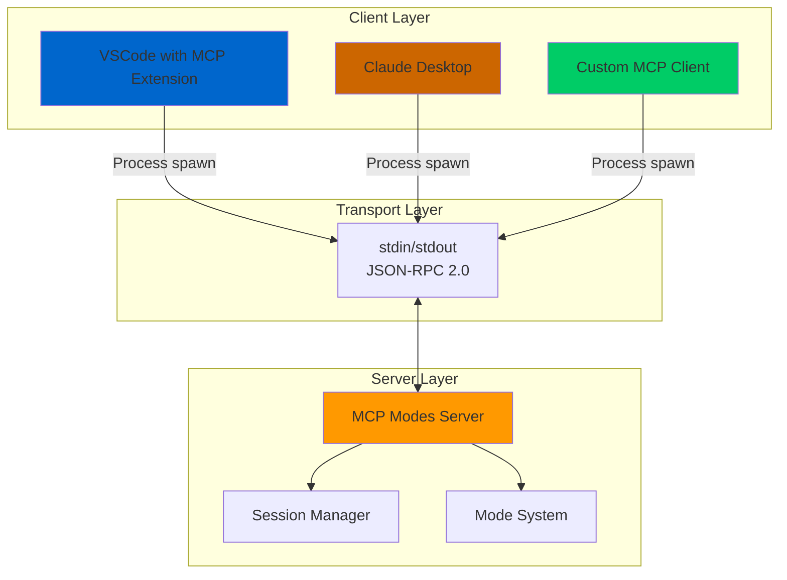
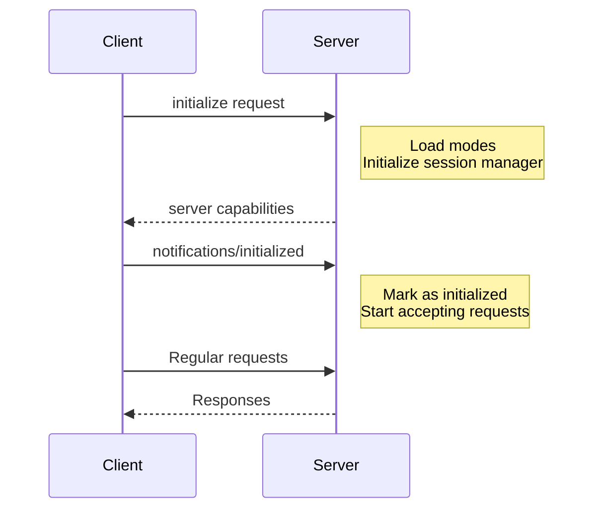

# MCP Modes Server - Integration Guide

This guide covers how to integrate the MCP Modes Server with various platforms and build custom clients. Whether you're using VSCode, Claude Desktop, or building your own MCP client, this guide has you covered.

## Table of Contents

1. [Integration Overview](#integration-overview)
2. [VSCode Integration](#vscode-integration)
3. [Claude Desktop Integration](#claude-desktop-integration)
4. [Building Custom MCP Clients](#building-custom-mcp-clients)
5. [Protocol Specifications](#protocol-specifications)
6. [Security Considerations](#security-considerations)
7. [Performance Tuning](#performance-tuning)
8. [Advanced Topics](#advanced-topics)

---

## Integration Overview

### What You'll Learn

This guide will teach you how to:

- Set up the MCP Modes Server with popular MCP clients
- Configure server parameters for your environment
- Build custom integrations with the MCP protocol
- Implement security best practices
- Optimize performance for your use case

### Prerequisites

Before integrating, ensure you have:

- MCP Modes Server installed ([see User Guide](MCP_MODES_SERVER_USER_GUIDE.md#installation))
- Basic understanding of JSON-RPC 2.0
- Python 3.8+ installed
- Appropriate MCP client (VSCode extension, Claude Desktop, or custom)

### Integration Architecture



---

## VSCode Integration

### Overview

The VSCode MCP extension allows you to use the MCP Modes Server directly within your VSCode workspace, enabling mode-aware AI assistance for your development workflow.

### Prerequisites

- VSCode 1.80.0 or higher
- MCP extension for VSCode (install from marketplace)
- MCP Modes Server installed and accessible

### Installation Steps

#### Step 1: Install VSCode MCP Extension

1. Open VSCode
2. Go to Extensions (Ctrl+Shift+X / Cmd+Shift+X)
3. Search for "Model Context Protocol"
4. Click Install

#### Step 2: Configure MCP Server

Create or edit your VSCode MCP configuration file:

**Location**: `.vscode/mcp.json` (workspace) or global settings

```json
{
  "mcpServers": {
    "roo-modes": {
      "command": "python",
      "args": [
        "-m",
        "roo_code.mcp",
        "--project-root",
        "${workspaceFolder}",
        "--log-level",
        "INFO"
      ],
      "env": {
        "ROO_CONFIG_DIR": "${userHome}/.roo-code",
        "PYTHONUNBUFFERED": "1"
      },
      "disabled": false
    }
  }
}
```

#### Step 3: Restart VSCode

After configuration, restart VSCode to load the MCP server.

### Configuration Options

#### Basic Configuration

```json
{
  "mcpServers": {
    "roo-modes": {
      "command": "python",
      "args": ["-m", "roo_code.mcp"],
      "disabled": false
    }
  }
}
```

#### Advanced Configuration

```json
{
  "mcpServers": {
    "roo-modes": {
      "command": "python",
      "args": [
        "-m",
        "roo_code.mcp",
        "--project-root",
        "${workspaceFolder}",
        "--config",
        "${workspaceFolder}/.roo-code/config.json",
        "--log-level",
        "DEBUG",
        "--log-file",
        "${workspaceFolder}/.roo-code/mcp.log"
      ],
      "env": {
        "ROO_CONFIG_DIR": "${userHome}/.roo-code",
        "ROO_SESSION_TIMEOUT": "7200",
        "ROO_CLEANUP_INTERVAL": "300",
        "PYTHONUNBUFFERED": "1",
        "PYTHONPATH": "${workspaceFolder}"
      },
      "disabled": false,
      "alwaysAllow": []
    }
  }
}
```

### VSCode-Specific Features

#### Workspace Variables

VSCode provides these variables for dynamic configuration:

- `${workspaceFolder}` - Current workspace root
- `${userHome}` - User's home directory
- `${workspaceFolderBasename}` - Workspace folder name
- `${file}` - Currently opened file
- `${fileBasename}` - Current file basename
- `${fileDirname}` - Current file's directory

#### Multi-Root Workspaces

For multi-root workspaces, configure per workspace:

```json
{
  "mcpServers": {
    "roo-modes-project-a": {
      "command": "python",
      "args": ["-m", "roo_code.mcp", "--project-root", "/path/to/project-a"]
    },
    "roo-modes-project-b": {
      "command": "python",
      "args": ["-m", "roo_code.mcp", "--project-root", "/path/to/project-b"]
    }
  }
}
```

### Usage in VSCode

Once configured:

1. **Access MCP Tools**: Open the command palette (Ctrl+Shift+P / Cmd+Shift+P)
2. **Type**: "MCP: " to see available commands
3. **Use Modes**: Create tasks, switch modes, query resources

### Troubleshooting VSCode Integration

#### Server Doesn't Start

**Check Extension Log:**
1. View → Output
2. Select "Model Context Protocol" from dropdown
3. Look for error messages

**Common Issues:**
- Python not in PATH
- Wrong Python version
- Module not found (roo_code not installed)

**Solution:**
```json
{
  "mcpServers": {
    "roo-modes": {
      "command": "/usr/local/bin/python3",  // Full path to Python
      "args": ["-m", "roo_code.mcp"]
    }
  }
}
```

#### Communication Errors

**Enable Debug Logging:**
```json
{
  "mcpServers": {
    "roo-modes": {
      "args": [
        "-m", "roo_code.mcp",
        "--log-level", "DEBUG",
        "--log-file", "${workspaceFolder}/mcp-debug.log"
      ]
    }
  }
}
```

Then check the log file for detailed error information.

---

## Claude Desktop Integration

### Overview

Claude Desktop supports MCP servers, allowing you to use the MCP Modes Server for enhanced AI capabilities with mode-based workflows.

### Prerequisites

- Claude Desktop application installed
- MCP Modes Server installed
- Python 3.8+ in your system PATH

### Installation Steps

#### Step 1: Locate Claude Desktop Config

The configuration file location varies by OS:

- **macOS**: `~/Library/Application Support/Claude/claude_desktop_config.json`
- **Windows**: `%APPDATA%/Claude/claude_desktop_config.json`
- **Linux**: `~/.config/Claude/claude_desktop_config.json`

#### Step 2: Add MCP Server Configuration

Edit the configuration file:

```json
{
  "mcpServers": {
    "roo-modes": {
      "command": "python",
      "args": [
        "-m",
        "roo_code.mcp",
        "--log-level",
        "INFO"
      ],
      "env": {
        "ROO_CONFIG_DIR": "~/.roo-code"
      }
    }
  }
}
```

#### Step 3: Restart Claude Desktop

Close and reopen Claude Desktop to load the MCP server.

### Configuration Options

#### Default Configuration

```json
{
  "mcpServers": {
    "roo-modes": {
      "command": "python",
      "args": ["-m", "roo_code.mcp"]
    }
  }
}
```

#### With Project Root

```json
{
  "mcpServers": {
    "roo-modes": {
      "command": "python",
      "args": [
        "-m",
        "roo_code.mcp",
        "--project-root",
        "/Users/yourname/projects/myproject"
      ]
    }
  }
}
```

#### Multiple Projects

```json
{
  "mcpServers": {
    "roo-modes-work": {
      "command": "python",
      "args": ["-m", "roo_code.mcp", "--project-root", "/Users/yourname/work"]
    },
    "roo-modes-personal": {
      "command": "python",
      "args": ["-m", "roo_code.mcp", "--project-root", "/Users/yourname/personal"]
    }
  }
}
```

### Usage in Claude Desktop

Once configured:

1. **Start Conversation**: Open Claude Desktop
2. **Access MCP Tools**: The tools will be automatically available
3. **Use Commands**: Claude can now use mode operations
4. **Create Tasks**: "Create a task in code mode to implement feature X"
5. **Switch Modes**: "Switch to debug mode to investigate this error"

### Troubleshooting Claude Desktop Integration

#### Server Not Loading

**Check Configuration File:**
```bash
# macOS
cat ~/Library/Application\ Support/Claude/claude_desktop_config.json | python -m json.tool

# Linux
cat ~/.config/Claude/claude_desktop_config.json | python -m json.tool
```

Ensure valid JSON syntax.

#### Python Path Issues

**Use Full Python Path:**
```json
{
  "mcpServers": {
    "roo-modes": {
      "command": "/usr/local/bin/python3",  // Full path
      "args": ["-m", "roo_code.mcp"]
    }
  }
}
```

**Find Python Path:**
```bash
which python3
# or
which python
```

#### Log File Access

**Configure Accessible Log Location:**
```json
{
  "mcpServers": {
    "roo-modes": {
      "command": "python",
      "args": [
        "-m", "roo_code.mcp",
        "--log-file", "~/claude-mcp-modes.log"
      ]
    }
  }
}
```

Then monitor:
```bash
tail -f ~/claude-mcp-modes.log
```

---

## Building Custom MCP Clients

### Overview

You can build custom MCP clients to integrate the Modes Server with your own applications, tools, or workflows.

### Client Requirements

A compliant MCP client must:

1. Spawn the server process
2. Communicate via stdin/stdout
3. Implement JSON-RPC 2.0 protocol
4. Handle MCP initialization handshake
5. Parse and send newline-delimited JSON

### Minimal Client Example (Python)

```python
import asyncio
import json
import subprocess
from typing import Any, Dict, Optional


class McpModesClient:
    """Minimal MCP Modes Server client."""
    
    def __init__(self, project_root: Optional[str] = None):
        """
        Initialize MCP client.
        
        Args:
            project_root: Project root directory
        """
        self.project_root = project_root
        self.process: Optional[subprocess.Popen] = None
        self.request_id = 0
        self.initialized = False
    
    async def start(self) -> None:
        """Start the MCP server process."""
        args = ["python", "-m", "roo_code.mcp"]
        
        if self.project_root:
            args.extend(["--project-root", self.project_root])
        
        self.process = subprocess.Popen(
            args,
            stdin=subprocess.PIPE,
            stdout=subprocess.PIPE,
            stderr=subprocess.PIPE,
            text=True,
            bufsize=1  # Line buffered
        )
        
        # Initialize connection
        await self.initialize()
    
    async def initialize(self) -> Dict[str, Any]:
        """Send initialize request."""
        response = await self.send_request("initialize", {
            "protocolVersion": "2024-11-05",
            "capabilities": {},
            "clientInfo": {
                "name": "custom-client",
                "version": "1.0.0"
            }
        })
        
        # Send initialized notification
        await self.send_notification("notifications/initialized")
        
        self.initialized = True
        return response
    
    async def send_request(
        self,
        method: str,
        params: Dict[str, Any]
    ) -> Dict[str, Any]:
        """
        Send JSON-RPC request and wait for response.
        
        Args:
            method: RPC method name
            params: Method parameters
            
        Returns:
            Response result
        """
        if not self.process:
            raise RuntimeError("Client not started")
        
        self.request_id += 1
        
        request = {
            "jsonrpc": "2.0",
            "id": self.request_id,
            "method": method,
            "params": params
        }
        
        # Send request
        request_line = json.dumps(request) + "\n"
        self.process.stdin.write(request_line)
        self.process.stdin.flush()
        
        # Read response
        response_line = self.process.stdout.readline()
        response = json.loads(response_line)
        
        if "error" in response:
            raise Exception(f"RPC Error: {response['error']}")
        
        return response.get("result", {})
    
    async def send_notification(self, method: str, params: Dict[str, Any] = None) -> None:
        """
        Send JSON-RPC notification (no response expected).
        
        Args:
            method: Notification method name
            params: Optional parameters
        """
        if not self.process:
            raise RuntimeError("Client not started")
        
        notification = {
            "jsonrpc": "2.0",
            "method": method,
            "params": params or {}
        }
        
        notification_line = json.dumps(notification) + "\n"
        self.process.stdin.write(notification_line)
        self.process.stdin.flush()
    
    async def list_modes(self, source: str = "all") -> Dict[str, Any]:
        """List available modes."""
        if not self.initialized:
            raise RuntimeError("Client not initialized")
        
        return await self.send_request("tools/call", {
            "name": "list_modes",
            "arguments": {"source": source}
        })
    
    async def create_task(
        self,
        mode_slug: str,
        initial_message: Optional[str] = None
    ) -> Dict[str, Any]:
        """Create a new task."""
        if not self.initialized:
            raise RuntimeError("Client not initialized")
        
        return await self.send_request("tools/call", {
            "name": "create_task",
            "arguments": {
                "mode_slug": mode_slug,
                "initial_message": initial_message
            }
        })
    
    async def get_task_info(
        self,
        session_id: str,
        include_messages: bool = False
    ) -> Dict[str, Any]:
        """Get task information."""
        if not self.initialized:
            raise RuntimeError("Client not initialized")
        
        return await self.send_request("tools/call", {
            "name": "get_task_info",
            "arguments": {
                "session_id": session_id,
                "include_messages": include_messages
            }
        })
    
    async def stop(self) -> None:
        """Stop the server process."""
        if self.process:
            self.process.stdin.close()
            self.process.wait(timeout=5)
            self.process = None


# Usage example
async def main():
    client = McpModesClient(project_root="/path/to/project")
    
    try:
        # Start server
        await client.start()
        print("Server started and initialized")
        
        # List modes
        modes = await client.list_modes()
        print(f"Available modes: {modes}")
        
        # Create task
        result = await client.create_task(
            mode_slug="code",
            initial_message="Create a new Python module"
        )
        print(f"Task created: {result}")
        
        session_id = result["metadata"]["session_id"]
        
        # Get task info
        info = await client.get_task_info(session_id)
        print(f"Task info: {info}")
        
    finally:
        await client.stop()
        print("Server stopped")


if __name__ == "__main__":
    asyncio.run(main())
```

### TypeScript Client Example

```typescript
import { spawn, ChildProcess } from 'child_process';
import * as readline from 'readline';

interface JsonRpcRequest {
  jsonrpc: '2.0';
  id: number;
  method: string;
  params: any;
}

interface JsonRpcResponse {
  jsonrpc: '2.0';
  id: number;
  result?: any;
  error?: {
    code: number;
    message: string;
    data?: any;
  };
}

class McpModesClient {
  private process?: ChildProcess;
  private requestId = 0;
  private initialized = false;
  private responseHandlers = new Map<number, (response: JsonRpcResponse) => void>();
  
  constructor(private projectRoot?: string) {}
  
  async start(): Promise<void> {
    const args = ['-m', 'roo_code.mcp'];
    
    if (this.projectRoot) {
      args.push('--project-root', this.projectRoot);
    }
    
    this.process = spawn('python', args, {
      stdio: ['pipe', 'pipe', 'pipe']
    });
    
    // Set up response handler
    const rl = readline.createInterface({
      input: this.process.stdout!,
      crlfDelay: Infinity
    });
    
    rl.on('line', (line) => {
      const response: JsonRpcResponse = JSON.parse(line);
      const handler = this.responseHandlers.get(response.id);
      
      if (handler) {
        handler(response);
        this.responseHandlers.delete(response.id);
      }
    });
    
    // Initialize
    await this.initialize();
  }
  
  private async initialize(): Promise<any> {
    const result = await this.sendRequest('initialize', {
      protocolVersion: '2024-11-05',
      capabilities: {},
      clientInfo: {
        name: 'typescript-client',
        version: '1.0.0'
      }
    });
    
    await this.sendNotification('notifications/initialized');
    this.initialized = true;
    
    return result;
  }
  
  async sendRequest(method: string, params: any): Promise<any> {
    if (!this.process) {
      throw new Error('Client not started');
    }
    
    this.requestId++;
    const id = this.requestId;
    
    const request: JsonRpcRequest = {
      jsonrpc: '2.0',
      id,
      method,
      params
    };
    
    return new Promise((resolve, reject) => {
      this.responseHandlers.set(id, (response) => {
        if (response.error) {
          reject(new Error(`RPC Error: ${response.error.message}`));
        } else {
          resolve(response.result);
        }
      });
      
      const requestLine = JSON.stringify(request) + '\n';
      this.process!.stdin!.write(requestLine);
    });
  }
  
  async sendNotification(method: string, params?: any): Promise<void> {
    if (!this.process) {
      throw new Error('Client not started');
    }
    
    const notification = {
      jsonrpc: '2.0',
      method,
      params: params || {}
    };
    
    const notificationLine = JSON.stringify(notification) + '\n';
    this.process.stdin!.write(notificationLine);
  }
  
  async listModes(source: string = 'all'): Promise<any> {
    if (!this.initialized) {
      throw new Error('Client not initialized');
    }
    
    return this.sendRequest('tools/call', {
      name: 'list_modes',
      arguments: { source }
    });
  }
  
  async createTask(modeSlug: string, initialMessage?: string): Promise<any> {
    if (!this.initialized) {
      throw new Error('Client not initialized');
    }
    
    return this.sendRequest('tools/call', {
      name: 'create_task',
      arguments: {
        mode_slug: modeSlug,
        initial_message: initialMessage
      }
    });
  }
  
  async stop(): Promise<void> {
    if (this.process) {
      this.process.stdin!.end();
      this.process.kill();
      this.process = undefined;
    }
  }
}

// Usage
(async () => {
  const client = new McpModesClient('/path/to/project');
  
  try {
    await client.start();
    console.log('Server started');
    
    const modes = await client.listModes();
    console.log('Modes:', modes);
    
    const task = await client.createTask('code', 'Create a module');
    console.log('Task:', task);
    
  } finally {
    await client.stop();
  }
})();
```

### Client Best Practices

#### 1. Process Management

```python
import atexit
import signal

class McpClient:
    def __init__(self):
        self.process = None
        
        # Register cleanup handlers
        atexit.register(self.cleanup)
        signal.signal(signal.SIGTERM, self._signal_handler)
        signal.signal(signal.SIGINT, self._signal_handler)
    
    def _signal_handler(self, signum, frame):
        self.cleanup()
        sys.exit(0)
    
    def cleanup(self):
        if self.process:
            self.process.terminate()
            self.process.wait(timeout=5)
```

#### 2. Error Handling

```python
async def safe_request(self, method: str, params: dict) -> dict:
    """Send request with comprehensive error handling."""
    max_retries = 3
    retry_delay = 1.0
    
    for attempt in range(max_retries):
        try:
            return await self.send_request(method, params)
            
        except ConnectionError:
            if attempt < max_retries - 1:
                await asyncio.sleep(retry_delay)
                retry_delay *= 2
            else:
                raise
        
        except json.JSONDecodeError as e:
            logger.error(f"Invalid JSON response: {e}")
            raise
        
        except Exception as e:
            logger.exception(f"Unexpected error: {e}")
            raise
```

#### 3. Timeout Handling

```python
async def send_request_with_timeout(
    self,
    method: str,
    params: dict,
    timeout: float = 30.0
) -> dict:
    """Send request with timeout."""
    try:
        return await asyncio.wait_for(
            self.send_request(method, params),
            timeout=timeout
        )
    except asyncio.TimeoutError:
        raise TimeoutError(f"Request to {method} timed out after {timeout}s")
```

#### 4. Logging

```python
import logging

logger = logging.getLogger(__name__)

class McpClient:
    async def send_request(self, method: str, params: dict) -> dict:
        logger.debug(f"Sending request: {method}")
        logger.debug(f"Parameters: {json.dumps(params, indent=2)}")
        
        response = await self._do_send_request(method, params)
        
        logger.debug(f"Received response: {json.dumps(response, indent=2)}")
        return response
```

---

## Protocol Specifications

### JSON-RPC 2.0 Format

All communication uses JSON-RPC 2.0 over stdin/stdout with newline-delimited JSON.

#### Request Format

```json
{
  "jsonrpc": "2.0",
  "id": 1,
  "method": "method_name",
  "params": {
    "param1": "value1",
    "param2": "value2"
  }
}
```

#### Response Format (Success)

```json
{
  "jsonrpc": "2.0",
  "id": 1,
  "result": {
    "data": "value"
  }
}
```

#### Response Format (Error)

```json
{
  "jsonrpc": "2.0",
  "id": 1,
  "error": {
    "code": -32001,
    "message": "Mode not found",
    "data": "Additional error details"
  }
}
```

#### Notification Format

```json
{
  "jsonrpc": "2.0",
  "method": "notification_name",
  "params": {
    "param1": "value1"
  }
}
```

### Error Codes

| Code | Name | Description |
|------|------|-------------|
| -32700 | Parse Error | Invalid JSON |
| -32600 | Invalid Request | Request structure invalid |
| -32601 | Method Not Found | Unknown method |
| -32602 | Invalid Params | Invalid parameters |
| -32603 | Internal Error | Server error |
| -32001 | Mode Not Found | Requested mode doesn't exist |
| -32002 | Task Not Found | Session/task doesn't exist |
| -32003 | Session Expired | Session timed out |
| -32004 | Validation Error | Input validation failed |
| -32005 | Tool Restriction Error | Tool not allowed in mode |
| -32006 | File Restriction Error | File editing not allowed |

### Initialization Sequence



#### Initialize Request

```json
{
  "jsonrpc": "2.0",
  "id": 1,
  "method": "initialize",
  "params": {
    "protocolVersion": "2024-11-05",
    "capabilities": {},
    "clientInfo": {
      "name": "my-client",
      "version": "1.0.0"
    }
  }
}
```

#### Initialize Response

```json
{
  "jsonrpc": "2.0",
  "id": 1,
  "result": {
    "protocolVersion": "2024-11-05",
    "capabilities": {
      "resources": {
        "listChanged": false
      },
      "tools": {
        "listChanged": false
      }
    },
    "serverInfo": {
      "name": "roo-modes-server",
      "version": "1.0.0"
    }
  }
}
```

#### Initialized Notification

```json
{
  "jsonrpc": "2.0",
  "method": "notifications/initialized",
  "params": {}
}
```

### Resource Operations

#### List Resources

**Request:**
```json
{
  "jsonrpc": "2.0",
  "id": 2,
  "method": "resources/list",
  "params": {}
}
```

**Response:**
```json
{
  "jsonrpc": "2.0",
  "id": 2,
  "result": {
    "resources": [
      {
        "uri": "mode://code",
        "name": "💻 Code",
        "mimeType": "application/json",
        "description": "Full configuration for code mode"
      },
      {
        "uri": "mode://code/config",
        "name": "💻 Code - Configuration",
        "mimeType": "application/json",
        "description": "Structured configuration for code mode"
      }
    ]
  }
}
```

#### Read Resource

**Request:**
```json
{
  "jsonrpc": "2.0",
  "id": 3,
  "method": "resources/read",
  "params": {
    "uri": "mode://code"
  }
}
```

**Response:**
```json
{
  "jsonrpc": "2.0",
  "id": 3,
  "result": {
    "contents": [
      {
        "uri": "mode://code",
        "mimeType": "application/json",
        "text": "{\"slug\":\"code\",\"name\":\"💻 Code\",...}"
      }
    ]
  }
}
```

### Tool Operations

#### List Tools

**Request:**
```json
{
  "jsonrpc": "2.0",
  "id": 4,
  "method": "tools/list",
  "params": {}
}
```

**Response:**
```json
{
  "jsonrpc": "2.0",
  "id": 4,
  "result": {
    "tools": [
      {
        "name": "list_modes",
        "description": "List all available modes",
        "inputSchema": {
          "type": "object",
          "properties": {
            "source": {
              "type": "string",
              "enum": ["builtin", "global", "project", "all"]
            }
          }
        }
      }
    ]
  }
}
```

#### Call Tool

**Request:**
```json
{
  "jsonrpc": "2.0",
  "id": 5,
  "method": "tools/call",
  "params": {
    "name": "create_task",
    "arguments": {
      "mode_slug": "code",
      "initial_message": "Create a module"
    }
  }
}
```

**Response:**
```json
{
  "jsonrpc": "2.0",
  "id": 5,
  "result": {
    "content": [
      {
        "type": "text",
        "text": "Task created successfully\n\nSession ID: sess_123..."
      }
    ],
    "metadata": {
      "session_id": "sess_123",
      "task_id": "task_456",
      "mode_slug": "code"
    }
  }
}
```

---

## Security Considerations

### Authentication and Authorization

#### Server Access Control

The MCP Modes Server runs as a subprocess and inherits the user's permissions.

**Best Practices:**

1. **Run as Limited User**
   ```bash
   # Create dedicated user for MCP operations
   sudo useradd -m -s /bin/bash mcp-user
   
   # Run server as that user
   sudo -u mcp-user python -m roo_code.mcp
   ```

2. **File System Restrictions**
   ```python
   # Use chroot or containerization
   docker run --rm -v /project:/workspace \
     python:3.9-slim \
     python -m roo_code.mcp --project-root /workspace
   ```

3. **Network Isolation**
   - Server uses stdin/stdout only, no network exposure
   - If wrapping with network layer, use TLS/SSL

#### Mode-Based Security

Modes enforce security through tool and file restrictions:

```yaml
customModes:
  - slug: readonly-audit
    name: 🔒 Read-Only Auditor
    groups:
      - read    # Can only read files
      - browser # Can browse for research
    # No edit, command, or mcp groups = very restricted
```

### Input Validation

All inputs are validated at multiple levels:

1. **Protocol Level**: JSON-RPC format validation
2. **Schema Level**: Parameter schema validation
3. **Business Logic Level**: Mode orchestrator validation

```python
# Example validation layers
try:
    # Layer 1: Protocol
    message = MessageParser.parse_message(line)
    
    # Layer 2: Schema
    SchemaValidator.validate_session_id(session_id)
    
    # Layer 3: Business logic
    orchestrator.validate_tool_use(task, tool_name, file_path)
    
except ValidationError as e:
    # Handle validation failure
    pass
```

### Sensitive Data Handling

#### Logging Security

```python
# Configure logging to avoid sensitive data
import logging

class SecureFormatter(logging.Formatter):
    def format(self, record):
        # Redact sensitive patterns
        message = super().format(record)
        message = re.sub(r'api_key=[^&\s]+', 'api_key=[REDACTED]', message)
        message = re.sub(r'password=[^&\s]+', 'password=[REDACTED]', message)
        return message
```

#### Session Data Protection

- Sessions stored in memory only (by default)
- Automatic cleanup prevents data leakage
- No session data persisted to disk (unless explicitly enabled)

### Network Security

If exposing MCP server over network (not recommended):

```python
# Example secure wrapper (illustration only)
import ssl
from aiohttp import web

app = web.Application()

ssl_context = ssl.create_default_context(ssl.Purpose.CLIENT_AUTH)
ssl_context.load_cert_chain('server.crt', 'server.key')

web.run_app(app, ssl_context=ssl_context, port=8443)
```

**Better Approach**: Use SSH tunneling instead:

```bash
# On remote server
python -m roo_code.mcp

# On local machine
ssh -L 9000:localhost:9000 user@remote-server \
  "python -m roo_code.mcp"
```

---

## Performance Tuning

### Server Configuration

#### Session Timeout Optimization

```bash
# For long-running tasks
export ROO_SESSION_TIMEOUT=14400  # 4 hours

# For short-lived tasks
export ROO_SESSION_TIMEOUT=900   # 15 minutes
```

#### Cleanup Interval Tuning

```bash
# More frequent cleanup (higher CPU, lower memory)
export ROO_CLEANUP_INTERVAL=60   # 1 minute

# Less frequent cleanup (lower CPU, higher memory)
export ROO_CLEANUP_INTERVAL=600  # 10 minutes
```

### Client Optimization

#### Connection Pooling

```python
class McpClientPool:
    def __init__(self, size: int = 5):
        self.pool = asyncio.Queue(maxsize=size)
        self.size = size
    
    async def initialize(self):
        for _ in range(self.size):
            client = McpModesClient()
            await client.start()
            await self.pool.put(client)
    
    async def acquire(self) -> McpModesClient:
        return await self.pool.get()
    
    async def release(self, client: McpModesClient):
        await self.pool.put(client)
    
    async def close(self):
        while not self.pool.empty():
            client = await self.pool.get()
            await client.stop()
```

#### Request Batching

```python
async def batch_requests(
    client: McpModesClient,
    requests: List[Tuple[str, dict]]
) -> List[dict]:
    """Execute multiple requests concurrently."""
    tasks = [
        client.send_request(method, params)
        for method, params in requests
    ]
    return await asyncio.gather(*tasks)
```

### Resource Management

#### Memory Optimization

```python
# Limit conversation history
MAX_MESSAGES_PER_TASK = 100

class OptimizedSessionManager(SessionManager):
    def add_message(self, session_id: str, message: Message):
        session = self.get_session(session_id)
        
        # Trim old messages
        if len(session.task.messages) >= MAX_MESSAGES_PER_TASK:
            session.task.messages = session.task.messages[-MAX_MESSAGES_PER_TASK:]
        
        session.task.messages.append(message)
```

#### CPU Optimization

```python
# Use process pool for CPU-intensive operations
from concurrent.futures import ProcessPoolExecutor

executor = ProcessPoolExecutor(max_workers=4)

async def heavy_operation(data):
    loop = asyncio.get_event_loop()
    return await loop.run_in_executor(executor, process_data, data)
```

### Monitoring

#### Performance Metrics

```python
import time
from functools import wraps

def measure_time(func):
    @wraps(func)
    async def wrapper(*args, **kwargs):
        start = time.time()
        result = await func(*args, **kwargs)
        duration = time.time() - start
        
        logger.info(f"{func.__name__} took {duration:.3f}s")
        return result
    
    return wrapper


class MetricsCollector:
    def __init__(self):
        self.request_count = 0
        self.error_count = 0
        self.total_duration = 0.0
    
    def record_request(self, duration: float, error: bool = False):
        self.request_count += 1
        self.total_duration += duration
        
        if error:
            self.error_count += 1
    
    def get_stats(self) -> dict:
        return {
            "requests": self.request_count,
            "errors": self.error_count,
            "avg_duration": self.total_duration / self.request_count if self.request_count > 0 else 0
        }
```

---

## Advanced Topics

### Custom Transport Layers

#### HTTP Wrapper Example

```python
from aiohttp import web
import asyncio

class HttpMcpBridge:
    def __init__(self):
        self.mcp_client = McpModesClient()
        self.app = web.Application()
        self.app.router.add_post('/rpc', self.handle_rpc)
    
    async def handle_rpc(self, request):
        data = await request.json()
        
        method = data.get('method')
        params = data.get('params', {})
        
        try:
            result = await self.mcp_client.send_request(method, params)
            return web.json_response(result)
            
        except Exception as e:
            return web.json_response(
                {'error': str(e)},
                status=500
            )
    
    async def start(self):
        await self.mcp_client.start()
        runner = web.AppRunner(self.app)
        await runner.setup()
        site = web.TCPSite(runner, 'localhost', 8080)
        await site.start()
```

### WebSocket Bridge

```python
import websockets
import json

async def websocket_handler(websocket, path):
    client = McpModesClient()
    await client.start()
    
    try:
        async for message in websocket:
            data = json.loads(message)
            
            result = await client.send_request(
                data['method'],
                data['params']
            )
            
            await websocket.send(json.dumps(result))
            
    finally:
        await client.stop()

# Start server
start_server = websockets.serve(websocket_handler, 'localhost', 8765)
asyncio.get_event_loop().run_until_complete(start_server)
```

### Health Checks

```python
class HealthCheck:
    def __init__(self, client: McpModesClient):
        self.client = client
    
    async def check_health(self) -> dict:
        """Comprehensive health check."""
        health = {
            'status': 'unknown',
            'checks': {}
        }
        
        try:
            # Check server responsiveness
            start = time.time()
            await self.client.send_request('tools/list', {})
            duration = time.time() - start
            
            health['checks']['responsiveness'] = {
                'status': 'pass',
                'duration': duration
            }
            
            # Check modes available
            modes = await self.client.list_modes()
            health['checks']['modes'] = {
                'status': 'pass',
                'count': len(modes.get('content', []))
            }
            
            health['status'] = 'healthy'
            
        except Exception as e:
            health['status'] = 'unhealthy'
            health['error'] = str(e)
        
        return health
```

---

## Summary

This integration guide covered:

✅ VSCode integration with configuration examples  
✅ Claude Desktop integration and setup  
✅ Building custom MCP clients in Python and TypeScript  
✅ Complete protocol specifications  
✅ Security best practices and considerations  
✅ Performance tuning strategies  
✅ Advanced topics like custom transports and monitoring  

### Next Steps

- **User Guide**: Learn about [using the server](MCP_MODES_SERVER_USER_GUIDE.md)
- **API Reference**: Detailed [API documentation](MCP_MODES_SERVER_API.md)
- **Examples**: Check the examples directory for more code samples

### Getting Help

- **GitHub Issues**: Report bugs or request features
- **Discussions**: Ask questions and share integrations
- **Documentation**: See the main README for more resources

---

**Last Updated**: 2025-01-13  
**Version**: 1.0.0