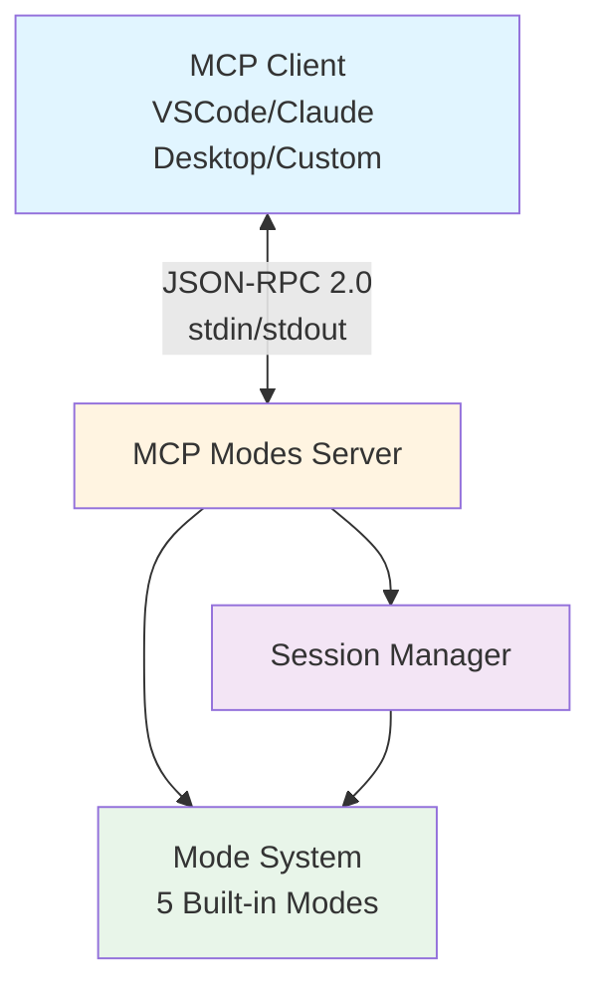
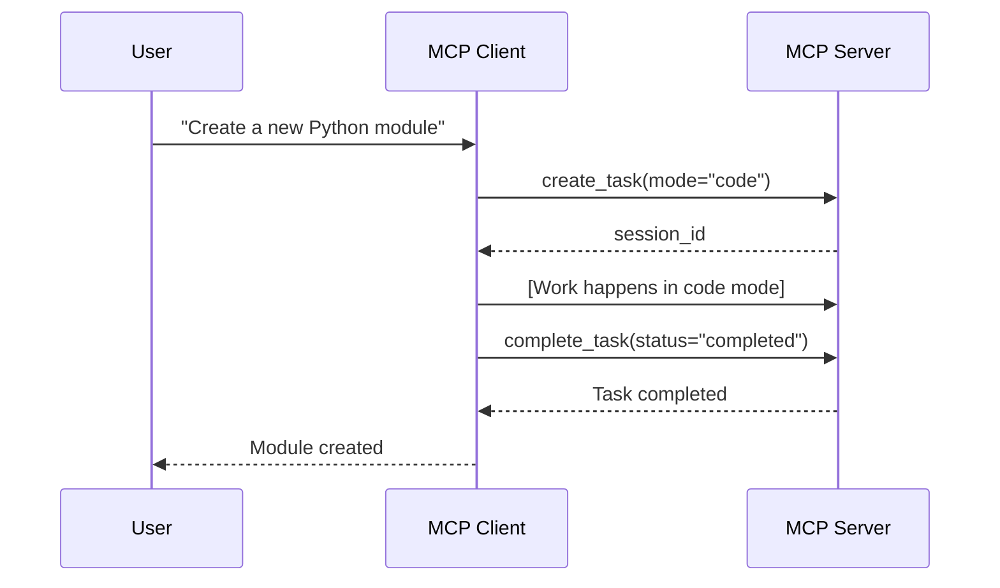
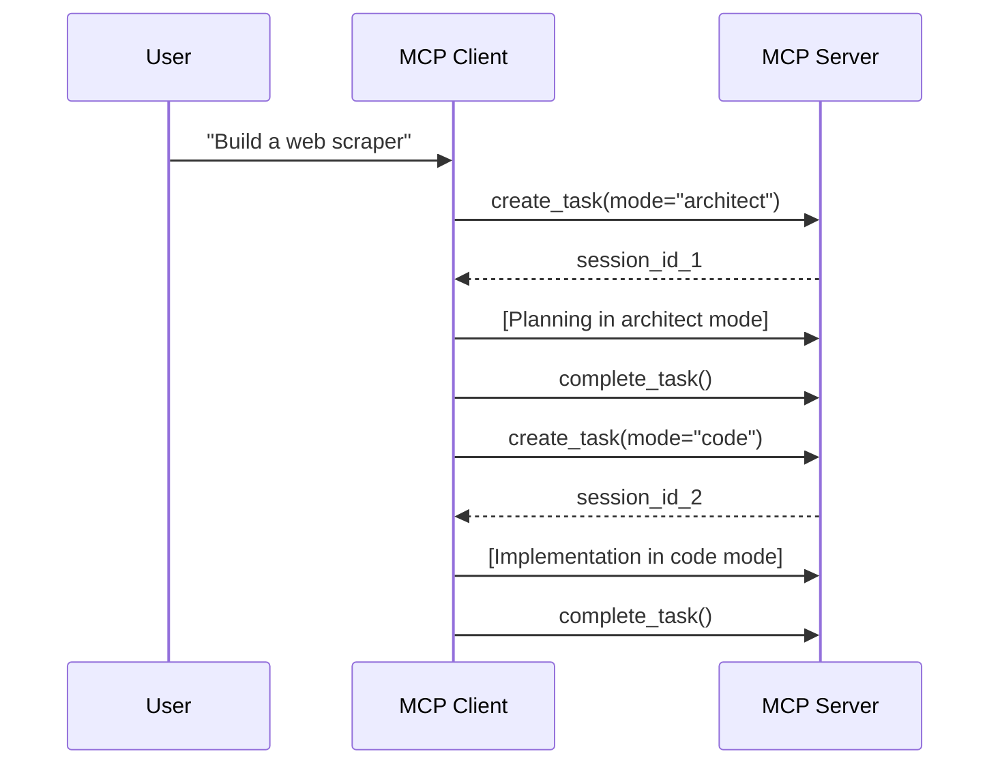
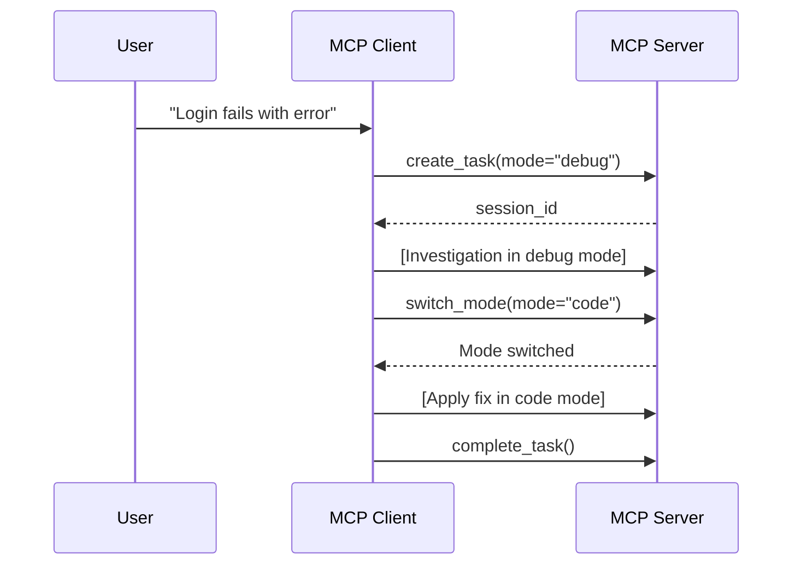
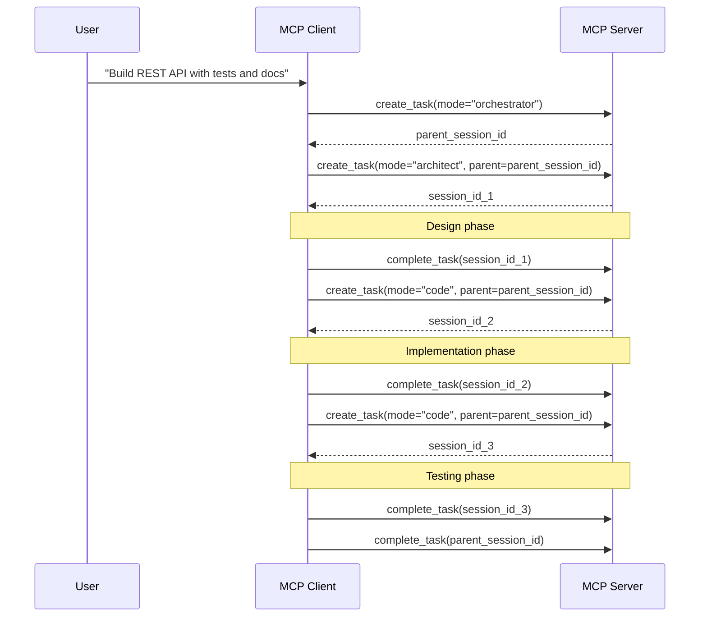

# MCP Modes Server - User Guide

Welcome to the MCP Modes Server user guide! This document will help you understand, install, configure, and use the MCP Modes Server to leverage Roo-Code's powerful mode system through the Model Context Protocol.

## Table of Contents

1. [What is the MCP Modes Server?](#what-is-the-mcp-modes-server)
2. [Why Use It?](#why-use-it)
3. [Installation](#installation)
4. [Getting Started](#getting-started)
5. [Configuration](#configuration)
6. [Using the Server](#using-the-server)
7. [Common Workflows](#common-workflows)
8. [Troubleshooting](#troubleshooting)
9. [FAQ](#faq)

---

## What is the MCP Modes Server?

The MCP Modes Server exposes Roo-Code's sophisticated mode system through the Model Context Protocol (MCP), enabling external applications and tools to interact with different operational modes for AI agents.

### Key Concepts

**Modes** are different operational contexts that change how an AI agent behaves and which tools it can use. Think of modes as specialized personas, each optimized for different types of tasks:

- **Code Mode**: For writing and modifying code
- **Architect Mode**: For planning and design (read-only except for markdown)
- **Ask Mode**: For questions and explanations (read-only)
- **Debug Mode**: For troubleshooting and investigating issues
- **Orchestrator Mode**: For coordinating complex multi-step workflows

**Tasks** represent units of work within a specific mode. Each task maintains its own conversation history and state.

**Sessions** track the lifecycle of tasks, managing timeouts and providing isolation between different workflows.

### Architecture Overview



---

## Why Use It?

The MCP Modes Server provides several key benefits:

### 1. **Structured AI Workflows**
- Define clear boundaries for what an AI agent can do in each mode
- Prevent accidental edits or actions outside the current scope
- Enable multi-step workflows with appropriate mode transitions

### 2. **Tool Restriction Enforcement**
- Each mode has specific tool groups it can access
- File restrictions can limit edits to specific file types
- Security-first design with validation at multiple levels

### 3. **Task Management**
- Create and track multiple concurrent tasks
- Maintain parent-child task hierarchies
- Automatic session cleanup and timeout handling

### 4. **Standards-Based Integration**
- Full MCP protocol compliance (JSON-RPC 2.0)
- Works with any MCP-compatible client
- Easy integration with existing tools and workflows

### 5. **Zero External Dependencies**
- Uses only Python standard library
- Lightweight and fast
- Easy to deploy and maintain

---

## Installation

### Prerequisites

- Python 3.8 or higher
- Roo-Code Python SDK installed

### Installation Steps

#### Option 1: Install from Source

```bash
# Clone the repository
git clone https://github.com/your-org/roo-code-python.git
cd roo-code-python

# Install with pip
pip install -e .
```

#### Option 2: Install from PyPI (when available)

```bash
pip install roo-code
```

### Verify Installation

```bash
# Test that the server can be launched
python -m roo_code.mcp --help
```

You should see the help output showing available command-line options.

---

## Getting Started

### Quick Start in 3 Steps

#### Step 1: Start the Server

```bash
# Start with default settings
python -m roo_code.mcp
```

The server will start and wait for JSON-RPC messages on stdin.

#### Step 2: Connect a Client

The MCP Modes Server communicates via stdin/stdout using JSON-RPC 2.0. Most users will connect through an MCP client like VSCode or Claude Desktop rather than directly.

For VSCode integration, see the [Integration Guide](MCP_MODES_SERVER_INTEGRATION.md).

#### Step 3: Start Using Modes

Once connected through a client, you can:

1. List available modes
2. Create tasks in specific modes
3. Switch modes as needed
4. Query mode configurations
5. Manage task lifecycle

See [Using the Server](#using-the-server) for detailed examples.

### Your First Task

Here's a simple workflow example:

1. **List Available Modes**
   - See what modes are available
   - Understand their capabilities

2. **Create a Task in Code Mode**
   - Start a new coding task
   - Get a session ID for the task

3. **Query Task Information**
   - Check task state
   - See available tools

4. **Switch to Debug Mode (if needed)**
   - Change mode during execution
   - Get different tool access

5. **Complete the Task**
   - Mark as completed, failed, or cancelled
   - Clean up resources

---

## Configuration

The server supports three configuration methods, in order of precedence:

1. Command-line arguments (highest priority)
2. Environment variables
3. Configuration file
4. Built-in defaults (lowest priority)

### Command-Line Options

```bash
python -m roo_code.mcp [OPTIONS]

Options:
  --project-root PATH      Project root directory
  --config PATH           Path to configuration file
  --log-level LEVEL       Logging level (DEBUG, INFO, WARNING, ERROR)
  --log-file PATH         Path to log file
```

### Environment Variables

Set these before starting the server:

```bash
# Project and configuration paths
export ROO_PROJECT_ROOT=/path/to/project
export ROO_CONFIG_DIR=~/.roo-code

# Session settings
export ROO_SESSION_TIMEOUT=3600        # Seconds (default: 1 hour)
export ROO_CLEANUP_INTERVAL=300        # Seconds (default: 5 minutes)

# Logging
export ROO_LOG_LEVEL=INFO
export ROO_LOG_FILE=~/.roo-code/mcp_modes_server.log
```

### Configuration File

Create a JSON configuration file (e.g., `~/.roo-code/mcp_config.json`):

```json
{
  "server": {
    "name": "roo-modes-server",
    "version": "1.0.0",
    "description": "MCP server exposing Roo-Code mode system"
  },
  "paths": {
    "project_root": null,
    "global_config_dir": "~/.roo-code"
  },
  "sessions": {
    "timeout": 3600,
    "cleanup_interval": 300,
    "persistence": {
      "enabled": false,
      "storage_path": "~/.roo-code/mcp_sessions"
    }
  },
  "logging": {
    "level": "INFO",
    "file": "~/.roo-code/mcp_modes_server.log",
    "format": "%(asctime)s - %(name)s - %(levelname)s - %(message)s"
  }
}
```

Then start with:

```bash
python -m roo_code.mcp --config ~/.roo-code/mcp_config.json
```

### Configuration Options Explained

#### Server Settings

- **name**: Server identifier (appears in initialization)
- **version**: Server version string
- **description**: Human-readable description

#### Path Settings

- **project_root**: Directory containing project-specific modes (`.roomodes` file)
  - If null, modes are loaded from current working directory
- **global_config_dir**: Directory for global configuration
  - Default: `~/.roo-code`
  - Contains global modes, logs, and session storage

#### Session Settings

- **timeout**: Seconds of inactivity before session expires
  - Default: 3600 (1 hour)
  - Prevents resource leaks from abandoned sessions
  
- **cleanup_interval**: Seconds between session cleanup checks
  - Default: 300 (5 minutes)
  - Background task that removes expired sessions

- **persistence** (future feature):
  - **enabled**: Whether to save session state to disk
  - **storage_path**: Where to store session data

#### Logging Settings

- **level**: Logging verbosity
  - DEBUG: Detailed diagnostic information
  - INFO: General informational messages
  - WARNING: Warning messages
  - ERROR: Error messages only
  
- **file**: Path to log file
  - Logs are written here for permanent storage
  - stderr also receives log output (stdout is reserved for JSON-RPC)

- **format**: Python logging format string

---

## Using the Server

### Available Resources

The server exposes modes as MCP resources using the URI scheme `mode://{slug}[/subresource]`.

#### Resource Types

1. **Full Mode Resource**: `mode://code`
   - Complete mode configuration
   - All metadata, tool groups, and settings
   - MIME type: `application/json`

2. **Config Resource**: `mode://code/config`
   - Structured configuration only
   - Group definitions with restrictions
   - MIME type: `application/json`

3. **System Prompt Resource**: `mode://code/system_prompt`
   - The actual system prompt used for the mode
   - Generated dynamically
   - MIME type: `text/plain`

#### Example Resource Response

```json
{
  "uri": "mode://code",
  "name": "💻 Code",
  "mimeType": "application/json",
  "description": "Write, modify, or refactor code"
}
```

### Available Tools

The server provides 7 tools for mode operations:

#### 1. list_modes

List all available modes with their metadata.

**Input Parameters:**
```json
{
  "source": "all"  // Optional: "builtin", "global", "project", or "all"
}
```

**Example Output:**
```
Available modes:

1. code (💻 Code) - builtin
   Description: Write, modify, or refactor code
   Tool groups: read, edit, browser, command, mcp, modes

2. architect (🏗️ Architect) - builtin
   Description: Plan, design, or strategize before implementation
   Tool groups: read, browser, mcp, modes, edit (\.md$)
```

#### 2. get_mode_info

Get detailed information about a specific mode.

**Input Parameters:**
```json
{
  "mode_slug": "code",
  "include_system_prompt": false  // Optional
}
```

**Example Output:**
```
Mode: 💻 Code (code)
Source: builtin
Description: Write, modify, or refactor code

When to use:
Use this mode when you need to write, modify, or refactor code...

Tool Groups:
✓ read
✓ edit
✓ browser
✓ command
✓ mcp
✓ modes

Custom Instructions:
- Always consider existing code context
- Follow project coding standards
...
```

#### 3. create_task

Create a new task in a specific mode.

**Input Parameters:**
```json
{
  "mode_slug": "code",
  "initial_message": "Create a new Python module",  // Optional
  "parent_session_id": null  // Optional, for subtasks
}
```

**Example Output:**
```
Task created successfully

Session ID: sess_abc123def456
Task ID: task_xyz789
Mode: code (💻 Code)
State: active

Use this session_id for subsequent operations.
```

**Response Metadata:**
```json
{
  "session_id": "sess_abc123def456",
  "task_id": "task_xyz789",
  "mode_slug": "code"
}
```

#### 4. switch_mode

Switch a task to a different mode.

**Input Parameters:**
```json
{
  "session_id": "sess_abc123def456",
  "new_mode_slug": "debug",
  "reason": "Need to investigate an error"  // Optional
}
```

**Example Output:**
```
Mode switched successfully

Session: sess_abc123def456
Old mode: code
New mode: debug
Reason: Need to investigate an error

New tool groups:
✓ read
✓ edit
✓ browser
✓ command
✓ mcp
✓ modes
```

#### 5. get_task_info

Get information about a task/session.

**Input Parameters:**
```json
{
  "session_id": "sess_abc123def456",
  "include_messages": false,     // Optional
  "include_hierarchy": false     // Optional
}
```

**Example Output:**
```
Task Information

Session ID: sess_abc123def456
Task ID: task_xyz789
Mode: code (💻 Code)
State: active
Created: 2025-01-13T10:30:00.000Z

Session Age: 300s
Idle Time: 60s
```

With `include_hierarchy: true`:
```
Hierarchy:
  Parent Task: task_parent123
  Child Tasks: task_child456, task_child789
```

#### 6. validate_tool_use

Check if a tool can be used in the current mode.

**Input Parameters:**
```json
{
  "session_id": "sess_abc123def456",
  "tool_name": "write_to_file",
  "file_path": "test.py"  // Optional, for edit operations
}
```

**Example Output:**
```
Tool validation result

Tool: write_to_file
Session: sess_abc123def456
Mode: architect

Result: ❌ Not allowed
Reason: Tool group 'edit' is restricted to files matching: \.md$
```

#### 7. complete_task

Mark a task as completed, failed, or cancelled.

**Input Parameters:**
```json
{
  "session_id": "sess_abc123def456",
  "status": "completed",  // "completed", "failed", or "cancelled"
  "result": "Successfully created the module"  // Optional
}
```

**Example Output:**
```
Task completed successfully

Session: sess_abc123def456
Task: task_xyz789
Status: completed
Result: Successfully created the module

The session will be cleaned up automatically.
```

---

## Common Workflows

### Workflow 1: Simple Coding Task



**Steps:**

1. Create task in code mode
2. Work proceeds with full tool access
3. Complete the task when done

### Workflow 2: Plan Then Implement



**Steps:**

1. Start in architect mode to plan
2. Create design documentation (markdown only)
3. Complete planning task
4. Create new task in code mode
5. Implement based on the plan
6. Complete implementation task

### Workflow 3: Debug and Fix



**Steps:**

1. Create task in debug mode
2. Investigate the issue systematically
3. Switch to code mode when fix is identified
4. Apply the fix with full edit capabilities
5. Complete the task

### Workflow 4: Complex Multi-Step Project



**Steps:**

1. Create parent task in orchestrator mode
2. Create subtask in architect mode (design)
3. Create subtask in code mode (implementation)
4. Create subtask in code mode (tests and docs)
5. Complete parent task

---

## Troubleshooting

### Common Issues

#### Issue: Server Won't Start

**Symptoms:**
- No output when running `python -m roo_code.mcp`
- Immediate exit
- Error messages

**Solutions:**

1. **Check Python version:**
   ```bash
   python --version  # Should be 3.8+
   ```

2. **Verify installation:**
   ```bash
   pip show roo-code
   ```

3. **Check for conflicting processes:**
   ```bash
   # If using a specific port, check if it's in use
   lsof -i :PORT_NUMBER
   ```

4. **Run with debug logging:**
   ```bash
   python -m roo_code.mcp --log-level DEBUG
   ```

5. **Check log file:**
   ```bash
   tail -f ~/.roo-code/mcp_modes_server.log
   ```

#### Issue: Mode Not Found

**Symptoms:**
- Error when creating task: "Mode not found: xyz"
- Empty mode list

**Solutions:**

1. **List available modes:**
   - Use the `list_modes` tool to see what's actually available

2. **Check mode slug spelling:**
   - Built-in mode slugs: `code`, `architect`, `ask`, `debug`, `orchestrator`
   - Custom modes: Check `.roomodes` file in project root

3. **Verify project root:**
   ```bash
   # Start server with explicit project root
   python -m roo_code.mcp --project-root /path/to/project
   ```

4. **Check global config:**
   ```bash
   cat ~/.roo-code/modes.yaml
   ```

#### Issue: Session Expired

**Symptoms:**
- "Session not found" or "Session expired" error
- Lost task context

**Solutions:**

1. **Check session timeout:**
   - Default is 1 hour of inactivity
   - Increase if needed: `--session-timeout 7200` (2 hours)

2. **Keep session active:**
   - Regular operations reset the idle timer
   - Use `get_task_info` periodically if needed

3. **Enable session persistence (future):**
   ```json
   {
     "sessions": {
       "persistence": {
         "enabled": true,
         "storage_path": "~/.roo-code/mcp_sessions"
       }
     }
   }
   ```

#### Issue: Tool Use Blocked

**Symptoms:**
- "Tool restriction error"
- "Tool group 'X' is not enabled for this mode"

**Solutions:**

1. **Check mode capabilities:**
   ```bash
   # Use get_mode_info tool
   {"mode_slug": "architect", "include_system_prompt": false}
   ```

2. **Validate before using:**
   ```bash
   # Use validate_tool_use tool
   {"session_id": "sess_123", "tool_name": "write_to_file"}
   ```

3. **Switch to appropriate mode:**
   - If you need edit capabilities, switch to `code` or `debug` mode
   - If you need read-only, `ask` mode is sufficient

4. **Check file restrictions:**
   - Architect mode can only edit `.md` files
   - Custom modes may have regex restrictions

#### Issue: JSON-RPC Parse Error

**Symptoms:**
- "Parse error" response
- Invalid message format

**Solutions:**

1. **Verify message format:**
   ```json
   {
     "jsonrpc": "2.0",
     "id": 1,
     "method": "tools/call",
     "params": {
       "name": "list_modes",
       "arguments": {}
     }
   }
   ```

2. **Check newline delimiter:**
   - Messages must end with newline character
   - Each message on its own line

3. **Validate JSON:**
   ```bash
   echo '{"jsonrpc":"2.0","id":1,"method":"tools/list"}' | python -m json.tool
   ```

### Debugging Tips

#### Enable Debug Logging

```bash
python -m roo_code.mcp --log-level DEBUG --log-file debug.log
```

Then monitor the log:
```bash
tail -f debug.log
```

#### Test JSON-RPC Messages

Create a test script:

```python
import json
import sys

# Initialize request
init_msg = {
    "jsonrpc": "2.0",
    "id": 1,
    "method": "initialize",
    "params": {
        "protocolVersion": "2024-11-05",
        "capabilities": {},
        "clientInfo": {
            "name": "test-client",
            "version": "1.0.0"
        }
    }
}

# Send message
print(json.dumps(init_msg))
sys.stdout.flush()

# Wait for response
response = sys.stdin.readline()
print(f"Response: {response}", file=sys.stderr)
```

#### Check Mode Configuration

```bash
# If you have custom modes, verify YAML syntax
python -c "import yaml; yaml.safe_load(open('.roomodes'))"
```

---

## FAQ

### General Questions

**Q: What is the difference between a mode and a task?**

A: A **mode** defines the operational context (which tools are available, file restrictions, etc.). A **task** is an instance of work being done within a specific mode. Think of modes as job roles and tasks as specific assignments.

**Q: Can I create custom modes?**

A: Yes! You can create custom modes in two ways:
1. Global modes: `~/.roo-code/modes.yaml`
2. Project modes: `.roomodes` file in project root

See the [Custom Modes](#) section in the main documentation.

**Q: How many tasks can run simultaneously?**

A: The server can handle multiple concurrent tasks. Each task has its own session and operates independently. The practical limit depends on system resources.

**Q: What happens when a session expires?**

A: Expired sessions are automatically cleaned up by the background cleanup task. The task state is lost (unless persistence is enabled). The session timeout resets with each operation.

### Technical Questions

**Q: Why does the server use stdin/stdout instead of HTTP?**

A: The Model Context Protocol uses stdin/stdout for process-based communication, which is simpler, more secure, and doesn't require network configuration. It's also compatible with how VSCode and Claude Desktop launch MCP servers.

**Q: Can I use this with other LLM providers besides Anthropic?**

A: Yes! The MCP Modes Server is provider-agnostic. It works with any MCP-compatible client, which can use any LLM provider that supports tool use.

**Q: Is there a REST API available?**

A: Not currently. The server implements the MCP protocol which uses JSON-RPC 2.0 over stdin/stdout. If you need HTTP/REST access, you could create a wrapper service.

**Q: How do I backup session data?**

A: Session persistence is planned for a future release. Currently, sessions exist only in memory and are lost when the server stops.

**Q: Can modes be hot-reloaded while the server is running?**

A: Not currently. You need to restart the server to pick up changes to mode configurations. This is planned for a future release.

### Integration Questions

**Q: Does this work with VSCode?**

A: Yes! See the [Integration Guide](MCP_MODES_SERVER_INTEGRATION.md) for VSCode setup instructions.

**Q: Does this work with Claude Desktop?**

A: Yes! See the [Integration Guide](MCP_MODES_SERVER_INTEGRATION.md) for Claude Desktop setup instructions.

**Q: Can I build my own MCP client?**

A: Absolutely! The server follows the MCP specification. See the [Integration Guide](MCP_MODES_SERVER_INTEGRATION.md) for details on building custom clients.

**Q: What about Docker deployment?**

A: The server can run in Docker. Example Dockerfile:

```dockerfile
FROM python:3.9-slim
WORKDIR /app
COPY . .
RUN pip install -e .
CMD ["python", "-m", "roo_code.mcp"]
```

### Performance Questions

**Q: How much memory does the server use?**

A: Base memory usage is minimal (~50-100MB). Memory grows with active sessions and conversation history. Each session typically uses a few MB.

**Q: Are there any rate limits?**

A: The server itself has no rate limits. Your LLM provider may have rate limits on API calls.

**Q: How fast is mode switching?**

A: Mode switching is near-instant (< 10ms). It's just updating task state and configuration.

### Security Questions

**Q: How does file restriction work?**

A: Modes can specify regex patterns for allowed file paths. The orchestrator validates every edit operation against these patterns before allowing it.

**Q: Can tasks access files outside the project?**

A: By default, no. The project root defines the boundary. Tool implementations should respect this, though absolute paths could potentially escape if not validated.

**Q: Is communication encrypted?**

A: stdin/stdout communication is local to the machine. If you need encrypted communication, use SSH tunneling or a secure wrapper.

**Q: How are sessions isolated?**

A: Each session has its own task instance with independent state. Sessions cannot access each other's data.

---

## Next Steps

- **Integration Guide**: Learn how to integrate with [VSCode, Claude Desktop, and custom clients](MCP_MODES_SERVER_INTEGRATION.md)
- **API Reference**: Detailed [API documentation](MCP_MODES_SERVER_API.md) for all tools and resources
- **Architecture**: Deep dive into the [server architecture](../ARCHITECTURE_MCP_MODES_SERVER.md)
- **Mode System**: Learn about [creating custom modes](modes.md)

---

## Getting Help

- **Issues**: [GitHub Issues](https://github.com/your-org/roo-code-python/issues)
- **Discussions**: [GitHub Discussions](https://github.com/your-org/roo-code-python/discussions)
- **Documentation**: [Main README](../README.md)

---

**Last Updated**: 2025-01-13  
**Version**: 1.0.0