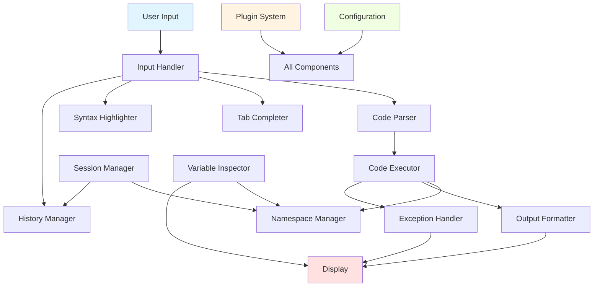
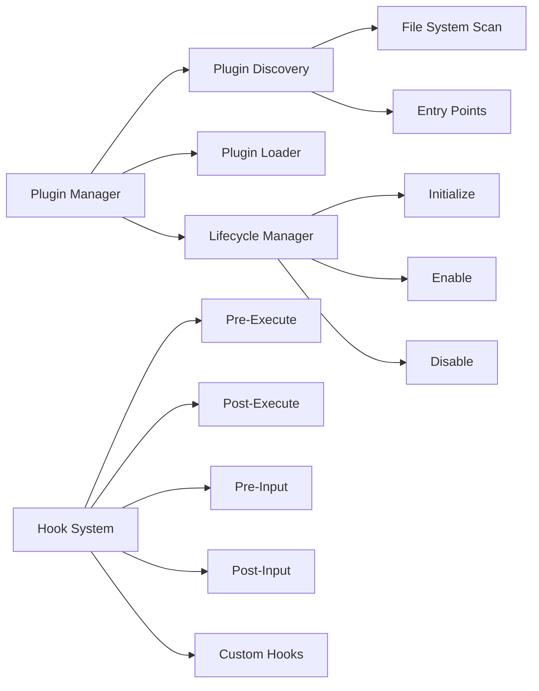
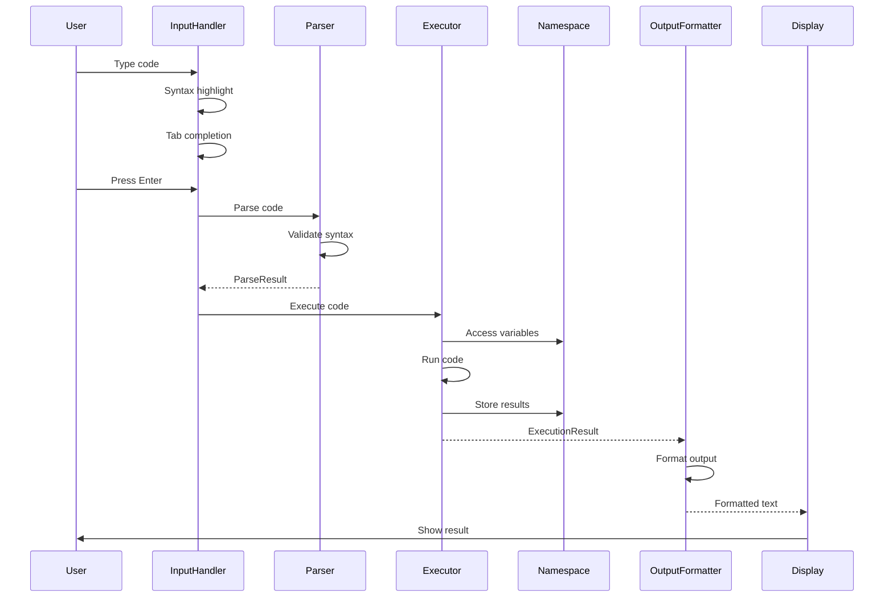
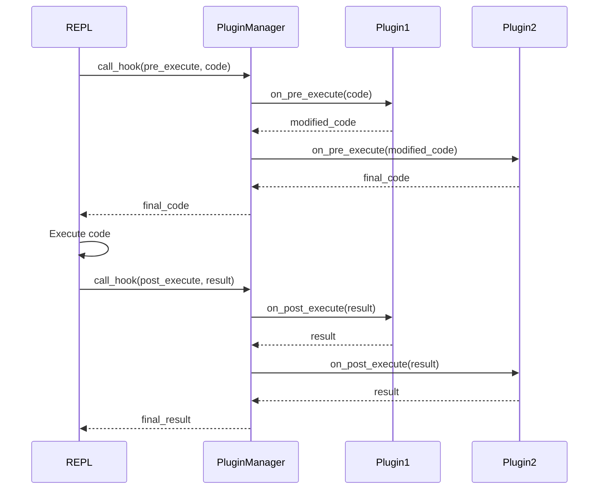

# Python REPL Architecture

## Overview

This document describes the architecture of a feature-rich, extensible Python REPL (Read-Eval-Print Loop) interpreter application. The system is designed with modularity, extensibility, and maintainability as core principles.

## Design Philosophy

1. **Separation of Concerns**: Each component has a single, well-defined responsibility
2. **Extensibility**: Plugin system allows adding functionality without modifying core code
3. **User Experience**: Rich interactive features with syntax highlighting, completion, and history
4. **Safety**: Robust error handling and namespace isolation
5. **Persistence**: Session state can be saved and restored

## System Architecture

### High-Level Component Diagram



### Core Components

#### 1. REPL Core (`repl/core.py`)

**Responsibility**: Main event loop coordination and lifecycle management

**Key Functions**:
- Initialize all subsystems (input, executor, history, etc.)
- Run the main REPL loop
- Coordinate between components
- Handle graceful shutdown

**Interface**:
```python
class REPLCore:
    def __init__(self, config: Config)
    def start() -> None
    def stop() -> None
    def execute_loop() -> None
    def handle_special_command(command: str) -> bool
```

**Main Loop Logic**:
```
1. Display prompt
2. Accept user input (via InputHandler)
3. Check for special commands (e.g., %exit, %save)
4. Parse input (via Parser)
5. Execute code (via Executor)
6. Format and display output (via OutputFormatter)
7. Handle any exceptions (via ExceptionHandler)
8. Update history
9. Repeat
```

#### 2. Input Handler (`repl/input_handler.py`)

**Responsibility**: Manage user input with advanced features

**Key Features**:
- Multi-line input detection (continuation prompts)
- Syntax highlighting in real-time
- Tab completion integration
- Key binding management
- Input validation

**Dependencies**:
- `prompt_toolkit` for rich input handling
- `Pygments` for syntax highlighting

**Interface**:
```python
class InputHandler:
    def __init__(self, completer: Completer, highlighter: Highlighter, history: History)
    def get_input(self, prompt: str = ">>> ", continuation: str = "... ") -> str
    def setup_key_bindings() -> KeyBindings
    def is_complete(self, code: str) -> bool
```

**Multi-line Detection**:
- Detect incomplete expressions (unclosed brackets, trailing operators)
- Show continuation prompt for multi-line statements
- Support explicit multi-line mode with triple quotes

#### 3. Code Parser (`repl/parser.py`)

**Responsibility**: Parse and validate Python code before execution

**Key Functions**:
- AST-based code parsing
- Syntax validation
- Detect expression vs statement
- Extract import statements
- Identify variable assignments

**Interface**:
```python
class CodeParser:
    def parse(self, code: str) -> ParseResult
    def is_expression(self, code: str) -> bool
    def validate_syntax(self, code: str) -> tuple[bool, Optional[str]]
    def extract_assignments(self, code: str) -> list[str]
```

**ParseResult Structure**:
```python
@dataclass
class ParseResult:
    ast_node: ast.AST
    is_expression: bool
    syntax_valid: bool
    error_message: Optional[str]
    assignments: list[str]
```

#### 4. Code Executor (`repl/executor.py`)

**Responsibility**: Execute Python code safely with namespace management

**Key Features**:
- Execute code in isolated namespace
- Maintain separate local and global namespaces
- Capture stdout/stderr
- Support for async code
- Execution timeout support

**Interface**:
```python
class CodeExecutor:
    def __init__(self, namespace_manager: NamespaceManager)
    def execute(self, code: str, parse_result: ParseResult) -> ExecutionResult
    def execute_async(self, code: str) -> ExecutionResult
    def reset_namespace() -> None
```

**ExecutionResult Structure**:
```python
@dataclass
class ExecutionResult:
    success: bool
    result: Any
    stdout: str
    stderr: str
    execution_time: float
    exception: Optional[Exception]
```

#### 5. Namespace Manager (`repl/namespace.py`)

**Responsibility**: Manage execution context and variable storage

**Key Features**:
- Separate local and global namespaces
- Variable tracking and inspection
- Namespace isolation
- Built-in functions and magic variables injection

**Interface**:
```python
class NamespaceManager:
    def __init__(self)
    def get_globals() -> dict
    def get_locals() -> dict
    def get_variable(self, name: str) -> Any
    def set_variable(self, name: str, value: Any) -> None
    def list_variables(self) -> list[str]
    def clear_namespace() -> None
    def get_namespace_snapshot() -> dict
    def restore_namespace_snapshot(snapshot: dict) -> None
```

**Magic Variables**:
- `_`: Last expression result
- `__`: Previous result
- `___`: Result before previous
- `_i`: Current input count
- `_ih`: Input history list

#### 6. Tab Completer (`repl/completion.py`)

**Responsibility**: Provide context-aware code completion

**Key Features**:
- Variable name completion
- Module and attribute completion
- Function/method signature hints
- File path completion for string literals
- Keyword completion

**Interface**:
```python
class TabCompleter:
    def __init__(self, namespace_manager: NamespaceManager)
    def get_completions(self, text: str, cursor_pos: int) -> list[Completion]
    def complete_attribute(self, obj: Any, partial: str) -> list[str]
    def complete_import(self, partial: str) -> list[str]
    def get_signature(self, callable_obj: Callable) -> str
```

**Completion Strategy**:
```
1. Detect completion context (variable, attribute, import, etc.)
2. Query namespace for matching names
3. Use inspect module for attribute/method discovery
4. Filter based on partial input
5. Rank by relevance
6. Return sorted completions with metadata
```

#### 7. Syntax Highlighter (`repl/highlighter.py`)

**Responsibility**: Apply syntax highlighting to code

**Key Features**:
- Real-time highlighting as user types
- Pygments integration for Python lexer
- Customizable color schemes
- Error highlighting for syntax errors

**Interface**:
```python
class SyntaxHighlighter:
    def __init__(self, style: str = "monokai")
    def highlight(self, code: str) -> FormattedText
    def set_style(self, style: str) -> None
    def highlight_error(self, code: str, error_pos: int) -> FormattedText
```

#### 8. History Manager (`repl/history.py`)

**Responsibility**: Manage command history with persistence

**Key Features**:
- Store command history in memory and on disk
- History search (Ctrl+R style)
- History navigation (up/down arrows)
- History filtering
- Session-based history organization

**Interface**:
```python
class HistoryManager:
    def __init__(self, history_file: str)
    def add(self, command: str) -> None
    def get_all() -> list[str]
    def search(self, query: str) -> list[str]
    def get_last(self, n: int = 1) -> list[str]
    def clear() -> None
    def save() -> None
    def load() -> None
```

**History File Format**:
```
# SQLite database with schema:
CREATE TABLE history (
    id INTEGER PRIMARY KEY,
    timestamp DATETIME,
    session_id TEXT,
    command TEXT,
    success BOOLEAN
)
```

#### 9. Exception Handler (`repl/exception_handler.py`)

**Responsibility**: Format and display exceptions elegantly

**Key Features**:
- Rich traceback formatting with syntax highlighting
- Variable inspection at exception point
- Suggestion system for common errors
- Exception filtering (hide internal frames)

**Interface**:
```python
class ExceptionHandler:
    def __init__(self, config: Config)
    def handle_exception(self, exc: Exception, code: str) -> FormattedOutput
    def format_traceback(self, tb: TracebackType) -> str
    def get_error_context(self, exc: Exception, code: str) -> dict
    def suggest_fix(self, exc: Exception) -> Optional[str]
```

**Error Display Format**:
```
[Error Type]: [Error Message]
    
    [Code Context with Error Line Highlighted]
    
[Formatted Traceback]

[Suggestion if available]
```

#### 10. Variable Inspector (`repl/inspector.py`)

**Responsibility**: Provide introspection capabilities for variables and objects

**Key Features**:
- Type information display
- Object attribute listing
- Method signature display
- Documentation lookup
- Memory usage information

**Interface**:
```python
class VariableInspector:
    def __init__(self, namespace_manager: NamespaceManager)
    def inspect(self, obj: Any) -> InspectionResult
    def get_type_info(self, obj: Any) -> str
    def get_attributes(self, obj: Any) -> list[str]
    def get_methods(self, obj: Any) -> list[str]
    def get_documentation(self, obj: Any) -> str
    def get_source(self, obj: Any) -> Optional[str]
```

**InspectionResult Structure**:
```python
@dataclass
class InspectionResult:
    type_name: str
    value_repr: str
    attributes: list[str]
    methods: list[str]
    documentation: str
    source: Optional[str]
    memory_size: int
```

#### 11. Output Formatter (`repl/output_formatter.py`)

**Responsibility**: Format execution results for display

**Key Features**:
- Type-specific formatting (lists, dicts, dataframes, etc.)
- Pretty printing with indentation
- Truncation for large outputs
- Color-coded output
- Rich display protocol support

**Interface**:
```python
class OutputFormatter:
    def __init__(self, config: Config)
    def format(self, obj: Any) -> str
    def format_exception(self, exc: Exception) -> str
    def format_dict(self, d: dict) -> str
    def format_list(self, lst: list) -> str
    def register_formatter(self, type_: type, formatter: Callable) -> None
```

**Formatter Registry**:
- Allow plugins to register custom formatters for specific types
- Fallback to repr() for unknown types
- Support for rich display objects (IPython style)

#### 12. Session Manager (`repl/session.py`)

**Responsibility**: Save and restore REPL sessions

**Key Features**:
- Save namespace state
- Save command history
- Session metadata (timestamp, Python version, etc.)
- Multiple session format support (pickle, JSON, dill)

**Interface**:
```python
class SessionManager:
    def __init__(self, namespace_manager: NamespaceManager, history: HistoryManager)
    def save_session(self, filepath: str) -> None
    def load_session(self, filepath: str) -> None
    def auto_save(self, interval: int) -> None
    def list_sessions(self, directory: str) -> list[str]
```

**Session File Format**:
```json
{
    "version": "1.0",
    "timestamp": "2024-01-15T10:30:00Z",
    "python_version": "3.11.0",
    "namespace": {
        "variables": "base64_encoded_pickle",
        "imports": ["module1", "module2"]
    },
    "history": ["command1", "command2"],
    "metadata": {
        "total_commands": 42,
        "session_duration": 3600
    }
}
```

#### 13. Plugin System (`repl/plugins/`)

**Responsibility**: Enable extensibility through plugins

**Architecture**:


**Plugin Manager Interface**:
```python
class PluginManager:
    def __init__(self, plugin_dir: str)
    def discover_plugins() -> list[PluginInfo]
    def load_plugin(self, plugin_name: str) -> Plugin
    def enable_plugin(self, plugin_name: str) -> None
    def disable_plugin(self, plugin_name: str) -> None
    def list_plugins() -> list[PluginInfo]
    def call_hook(self, hook_name: str, *args, **kwargs) -> None
```

**Plugin Base Class**:
```python
class Plugin(ABC):
    @property
    @abstractmethod
    def name(self) -> str:
        pass
    
    @property
    @abstractmethod
    def version(self) -> str:
        pass
    
    def initialize(self, repl_core: REPLCore) -> None:
        pass
    
    def on_pre_execute(self, code: str) -> Optional[str]:
        return code
    
    def on_post_execute(self, result: ExecutionResult) -> ExecutionResult:
        return result
    
    def on_exception(self, exc: Exception) -> None:
        pass
    
    def register_commands(self) -> dict[str, Callable]:
        return {}
    
    def shutdown(self) -> None:
        pass
```

**Hook System**:
- Pre-execute: Modify code before execution
- Post-execute: Process execution results
- Pre-input: Modify user input
- Post-input: Process formatted input
- Exception: Handle or log exceptions
- Command: Register custom REPL commands

**Plugin Discovery**:
1. Scan plugin directory for Python files
2. Check for entry points in package metadata
3. Validate plugin interface implementation
4. Load plugin metadata and dependencies

#### 14. Configuration System (`repl/config.py`)

**Responsibility**: Manage application configuration

**Key Features**:
- Hierarchical configuration (defaults < user < command-line)
- Multiple format support (YAML, JSON, TOML)
- Runtime configuration updates
- Configuration validation
- Environment variable support

**Interface**:
```python
class Configuration:
    def __init__(self, config_file: Optional[str] = None)
    def get(self, key: str, default: Any = None) -> Any
    def set(self, key: str, value: Any) -> None
    def load(self, filepath: str) -> None
    def save(self, filepath: str) -> None
    def validate() -> bool
    def to_dict() -> dict
```

**Configuration Structure**:
```yaml
# config.yaml
repl:
  prompt: ">>> "
  continuation_prompt: "... "
  auto_save: true
  auto_save_interval: 300  # seconds
  
display:
  syntax_highlighting: true
  color_scheme: "monokai"
  max_output_lines: 1000
  pretty_print: true
  
history:
  enabled: true
  file: "~/.python_repl_history"
  max_entries: 10000
  save_on_exit: true
  
completion:
  enabled: true
  fuzzy_matching: true
  show_signatures: true
  
execution:
  timeout: 30  # seconds
  capture_output: true
  async_support: true
  
plugins:
  enabled: true
  plugin_dir: "~/.python_repl/plugins"
  auto_load: ["plugin1", "plugin2"]
  
session:
  auto_save: false
  default_format: "json"
  
error_handling:
  show_full_traceback: true
  filter_internal_frames: true
  show_suggestions: true
```

## Data Flow

### Execution Flow



### Plugin Hook Flow



## Error Handling Strategy

### Error Categories

1. **Syntax Errors**: Caught during parsing, display with context
2. **Runtime Errors**: Caught during execution, format with traceback
3. **System Errors**: Internal REPL errors, log and display gracefully
4. **Plugin Errors**: Isolate plugin failures, don't crash REPL

### Error Recovery

```python
def execute_loop():
    while True:
        try:
            # Get input
            code = input_handler.get_input()
            
            # Parse
            try:
                parse_result = parser.parse(code)
            except SyntaxError as e:
                exception_handler.handle_syntax_error(e, code)
                continue
            
            # Execute
            try:
                result = executor.execute(code, parse_result)
            except Exception as e:
                exception_handler.handle_runtime_error(e, code)
                continue
            
            # Display
            output = output_formatter.format(result)
            display.show(output)
            
        except KeyboardInterrupt:
            display.show("^C")
            continue
        except EOFError:
            break
        except Exception as e:
            # System error - log and continue
            logger.error(f"System error: {e}")
            display.show("Internal error occurred")
            continue
```

## Project Directory Structure

```
python-repl-project/
├── README.md
├── ARCHITECTURE.md
├── LICENSE
├── setup.py
├── pyproject.toml
├── requirements.txt
├── requirements-dev.txt
│
├── repl/
│   ├── __init__.py
│   ├── __main__.py              # Entry point
│   ├── core.py                  # Main REPL loop
│   ├── input_handler.py         # Input handling with prompt_toolkit
│   ├── parser.py                # Code parsing and validation
│   ├── executor.py              # Code execution
│   ├── namespace.py             # Namespace management
│   ├── completion.py            # Tab completion
│   ├── highlighter.py           # Syntax highlighting
│   ├── history.py               # Command history
│   ├── exception_handler.py     # Exception formatting
│   ├── inspector.py             # Variable introspection
│   ├── output_formatter.py      # Output formatting
│   ├── session.py               # Session save/load
│   ├── config.py                # Configuration management
│   │
│   ├── plugins/
│   │   ├── __init__.py
│   │   ├── base.py              # Plugin base class
│   │   ├── manager.py           # Plugin manager
│   │   ├── hooks.py             # Hook system
│   │   └── discovery.py         # Plugin discovery
│   │
│   └── utils/
│       ├── __init__.py
│       ├── logger.py            # Logging utilities
│       ├── colors.py            # Color/theme utilities
│       └── validators.py        # Input validation
│
├── plugins/                      # Example plugins
│   ├── example_plugin.py
│   ├── timer_plugin.py          # Execution timing
│   ├── export_plugin.py         # Export code/session
│   └── debug_plugin.py          # Enhanced debugging
│
├── tests/
│   ├── __init__.py
│   ├── test_core.py
│   ├── test_input_handler.py
│   ├── test_parser.py
│   ├── test_executor.py
│   ├── test_namespace.py
│   ├── test_completion.py
│   ├── test_history.py
│   ├── test_session.py
│   ├── test_plugins.py
│   └── integration/
│       ├── __init__.py
│       └── test_repl_integration.py
│
├── docs/
│   ├── user_guide.md
│   ├── plugin_development.md
│   ├── api_reference.md
│   └── examples/
│       ├── basic_usage.md
│       └── advanced_features.md
│
├── config/
│   ├── default_config.yaml
│   └── themes/
│       ├── monokai.yaml
│       ├── solarized.yaml
│       └── default.yaml
│
└── examples/
    ├── sample_session.json
    ├── plugin_example.py
    └── custom_formatter.py
```

## Key Design Decisions

### 1. Dependency Management

**Chosen Approach**: Use established libraries for complex functionality

**Rationale**:
- `prompt_toolkit`: Industry-standard for building interactive CLI applications
- `Pygments`: Mature, comprehensive syntax highlighting
- `rich`: Modern terminal formatting (optional enhancement)

**Trade-offs**:
- Pro: Battle-tested, feature-rich, well-maintained
- Con: External dependencies increase package size
- Mitigation: Make some features optional

### 2. Namespace Isolation

**Chosen Approach**: Separate local and global namespaces with controlled access

**Rationale**:
- Prevent namespace pollution
- Enable clean session reset
- Support proper scoping semantics

**Implementation**:
```python
# Execute code with exec()
exec(compile(ast_node, '<repl>', 'exec'), globals_dict, locals_dict)

# For expressions, use eval()
result = eval(compile(ast_node, '<repl>', 'eval'), globals_dict, locals_dict)
```

### 3. Plugin Architecture

**Chosen Approach**: Hook-based system with lifecycle management

**Rationale**:
- Flexible extension points
- Plugins can't break core functionality
- Clear plugin lifecycle (init, enable, disable, shutdown)

**Hook Priority**:
- Plugins execute in registration order
- Each plugin can modify data for next plugin
- Exceptions in plugins are caught and logged

### 4. History Storage

**Chosen Approach**: SQLite database for persistent storage

**Rationale**:
- Structured queries (search, filter by date, etc.)
- ACID guarantees
- No external database server needed
- Efficient for thousands of entries

### 5. Configuration Hierarchy

**Chosen Approach**: Layered configuration with override priority

**Priority Order** (highest to lowest):
1. Command-line arguments
2. Environment variables
3. User config file (~/.python_repl/config.yaml)
4. Project config file (./repl_config.yaml)
5. Default configuration

### 6. Error Recovery

**Chosen Approach**: Graceful degradation with informative feedback

**Strategy**:
- Never crash the REPL for user code errors
- Isolate plugin errors
- Provide detailed error context
- Suggest fixes when possible

### 7. Async Support

**Chosen Approach**: Optional async execution with event loop integration

**Implementation**:
- Detect async code patterns
- Create/reuse event loop
- Use `asyncio.run()` or existing loop
- Display async results properly

## Performance Considerations

### 1. Input Handling
- Debounce syntax highlighting for large inputs
- Limit completion results to top 100 matches
- Cache completion data when namespace doesn't change

### 2. History Management
- Lazy-load history from database
- Keep recent history (last 100) in memory
- Batch writes for history saves

### 3. Output Formatting
- Truncate large outputs with "show more" option
- Stream large outputs instead of buffering
- Lazy evaluation for recursive structures

### 4. Plugin Execution
- Timeout for plugin hooks
- Async plugin execution where possible
- Cache plugin results when appropriate

## Security Considerations

### 1. Code Execution
- No sandboxing by default (user's own code)
- Optional restricted mode for educational use
- Clear warning when loading untrusted sessions

### 2. Plugin Security
- Validate plugin signatures (optional)
- User confirmation for new plugins
- Isolated plugin namespaces

### 3. Session Files
- Validate session file format
- Pickle safety warnings
- Option to review session contents before loading

## Testing Strategy

### Unit Tests
- Each component tested in isolation
- Mock dependencies
- Edge cases and error conditions
- 80%+ code coverage target

### Integration Tests
- End-to-end REPL scenarios
- Plugin integration
- Session save/load
- Multi-line input sequences

### Performance Tests
- Large history handling
- Big namespace serialization
- Completion performance with many variables
- Output formatting for large data structures

## Future Enhancements

### Phase 2 Features
1. **Notebook Mode**: Save sessions as executable notebooks
2. **Remote REPL**: Connect to remote Python interpreters
3. **Collaboration**: Multiple users in same REPL session
4. **Rich Media**: Display images, plots, HTML inline
5. **AI Assistant**: Code suggestions and explanations
6. **Debugger Integration**: Step through code, breakpoints
7. **Profiler**: Profile code execution
8. **Package Manager**: Install packages from within REPL

### Extensibility Points
- Custom input validators
- Output renderer plugins
- Custom completion sources
- Alternative execution backends
- Custom prompt themes
- Workspace management

## Dependencies

### Core Dependencies
```
prompt-toolkit >= 3.0.0    # Input handling
pygments >= 2.0.0          # Syntax highlighting
```

### Optional Dependencies
```
rich >= 13.0.0             # Enhanced output formatting
dill >= 0.3.0              # Better serialization
ipython >= 8.0.0           # IPython compatibility layer
jedi >= 0.19.0             # Advanced completion
```

### Development Dependencies
```
pytest >= 7.0.0
pytest-cov >= 4.0.0
pytest-asyncio >= 0.21.0
black >= 23.0.0
mypy >= 1.0.0
ruff >= 0.1.0
```

## Conclusion

This architecture provides a solid foundation for a feature-rich Python REPL with:
- Clear separation of concerns
- Extensible plugin system
- Rich interactive features
- Robust error handling
- Persistent sessions
- Professional code quality

The modular design allows each component to be developed, tested, and maintained independently while working together seamlessly through well-defined interfaces.
